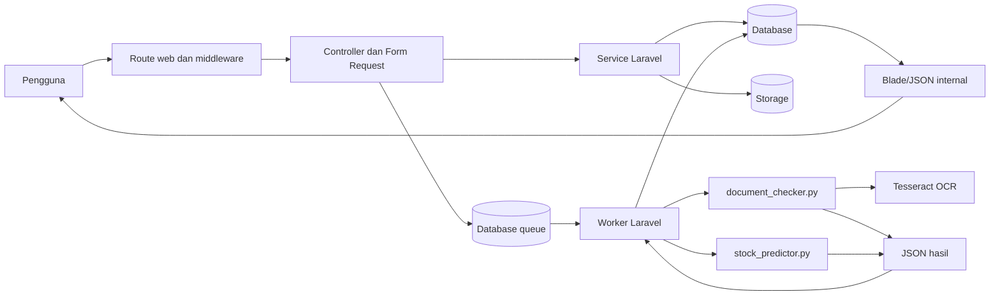
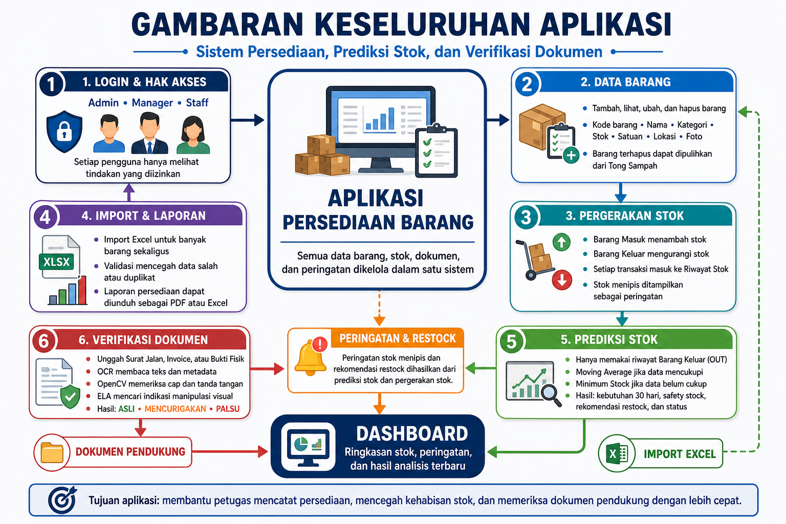

# LogistikKu

LogistikKu adalah aplikasi web pengelolaan persediaan berbasis Laravel 12. Aplikasi ini memusatkan data barang, pergerakan stok, peringatan stok menipis, verifikasi dokumen berbantuan OCR, dan prediksi kebutuhan stok dalam satu alur kerja dengan hak akses berbasis peran.

> **Status:** aplikasi dapat dijalankan untuk pengembangan dan evaluasi lokal. Fondasi data supplier dan multi-gudang sudah tersedia, tetapi belum seluruhnya mempunyai antarmuka pengguna. REST API publik juga belum tersedia.

## Navigasi

- [Latar belakang dan tujuan](#latar-belakang-dan-tujuan)
- [Fitur utama](#fitur-utama)
- [Teknologi](#teknologi)
- [Arsitektur Laravel-Python](#arsitektur-laravel-python)
- [Persyaratan sistem](#persyaratan-sistem)
- [Instalasi](#instalasi)
- [Konfigurasi](#konfigurasi)
- [Menjalankan aplikasi](#menjalankan-aplikasi)
- [Pengujian](#pengujian)
- [Role dan hak akses](#role-dan-hak-akses)
- [Import dan export](#import-dan-export)
- [Endpoint JSON internal](#endpoint-json-internal)
- [Struktur folder](#struktur-folder)
- [Dokumentasi dan visual](#dokumentasi-dan-visual)
- [Troubleshooting](#troubleshooting)
- [Batasan dan rencana pengembangan](#batasan-dan-rencana-pengembangan)

## Latar belakang dan tujuan

Pencatatan persediaan yang tersebar atau manual menyulitkan petugas mengetahui saldo terkini, menelusuri perubahan stok, dan mengenali barang yang perlu segera diisi ulang. Pemeriksaan dokumen pendukung dan perencanaan restock juga memerlukan waktu bila dilakukan tanpa bantuan sistem.

LogistikKu bertujuan untuk:

- menyediakan satu sumber data barang dan transaksi stok;
- menjaga perubahan stok tetap tercatat dan dapat ditelusuri;
- membantu pengguna menemukan stok menipis dan kebutuhan restock;
- mempercepat pemeriksaan awal Surat Jalan, Invoice, dan Bukti Fisik;
- membatasi tindakan berisiko sesuai tanggung jawab Admin, Manager, dan Staff Gudang.

## Fitur utama

| Area | Implementasi yang tersedia |
|---|---|
| Login | Autentikasi berbasis session dengan regenerasi session setelah login dan rate limit 5 percobaan per kombinasi email/IP selama 60 detik. |
| Manajemen barang | Admin dapat menambah, melihat, mengubah, dan menghapus barang. Kode dibuat otomatis, foto bersifat opsional, dan perubahan kode dicegah oleh model. |
| Stok masuk dan keluar | Admin, Manager, dan Staff dapat mencatat transaksi masuk/keluar. Perubahan saldo, saldo gudang utama, snapshot sebelum/sesudah, dan transaksi disimpan secara atomik. |
| Riwayat transaksi | Timeline, tabel berhalaman, dan grafik saldo memakai `stok_transactions`; maksimal 100 transaksi terbaru dipakai untuk grafik. |
| Pencarian dan daftar | Pencarian kode/nama/lokasi, filter kategori dan status stok, sorting nama/stok, serta pagination. Hasil dapat diperbarui tanpa memuat ulang seluruh halaman. |
| Stok menipis | Barang dengan stok `<= 5` ditampilkan pada dashboard dan halaman khusus. |
| Soft delete | Barang masuk ke Tong Sampah, dapat dipulihkan, dan dapat dihapus permanen bila tidak terhalang dependensi bisnis. Admin juga mempunyai aksi massal. |
| Role dan permission | Otorisasi memakai middleware `auth`, middleware role, Laravel Gate, validasi request, dan pemeriksaan kepemilikan dokumen. |
| Import dan export | Admin dapat mengimpor XLSX/XLS/CSV secara atomik serta mengekspor persediaan aktif ke XLSX, CSV, dan PDF. |
| Verifikasi dokumen | Laravel menyimpan file secara privat dan menjadwalkan job; Python menjalankan OCR Tesseract, ekstraksi metadata, pemeriksaan visual/manipulasi, lalu mengembalikan JSON. |
| Prediksi kebutuhan stok | Histori transaksi keluar dianalisis dengan metode `cold_start`, `simple_average`, atau regresi linear (`machine_learning`). Laravel menyediakan fallback lokal bila Python gagal. |
| Queue dan notifikasi | Verifikasi memakai queue `default`; prediksi memakai `stock-predictions`. Status proses, retry yang relevan, dan notifikasi hasil tersedia. |
| REST API | **Belum tersedia.** Tidak ada `routes/api.php`, autentikasi token/Sanctum, atau kontrak REST publik. Route JSON yang ada dipakai UI internal dan tetap memakai autentikasi sesi. |

Dashboard juga menyediakan ringkasan jumlah barang/stok/kategori, grafik aktivitas 7 atau 30 hari, Pusat Perhatian, dan status prediksi terbaru.

## Teknologi

| Lapisan | Teknologi yang digunakan |
|---|---|
| Backend | PHP 8.2+, Laravel 12, Eloquent ORM, Blade, Laravel Queue |
| Database | SQLite sebagai default `.env.example`; Laravel juga dikonfigurasi untuk MySQL/MariaDB. Dokumentasi database proyek diaudit terhadap MariaDB/MySQL. |
| Frontend | Template SkyDash/Bootstrap dan Chart.js dari aset lokal; Vite 6, Tailwind CSS 4, Axios, dan JavaScript sebagai toolchain npm |
| Import/export | Maatwebsite Excel, PhpSpreadsheet, generator CSV dan PDF internal |
| Integrasi proses | Symfony Process untuk menjalankan script Python dari Laravel |
| Analisis Python | Python 3.10+, PyMuPDF, Pillow, pytesseract, OpenCV, dan scikit-learn |
| OCR | Tesseract OCR dengan data bahasa Inggris dan/atau Indonesia |
| Pengujian | PHPUnit 11 dan Python `unittest` |

Versi dependency yang dikunci tersedia pada [`composer.lock`](composer.lock), [`package-lock.json`](package-lock.json), dan [`python/requirements.txt`](python/requirements.txt).

## Arsitektur Laravel-Python



1. Laravel menangani autentikasi, otorisasi, validasi, transaksi database, penyimpanan file, dan tampilan.
2. Job queue memanggil Python melalui Symfony Process. Python bukan server HTTP terpisah.
3. `document_checker.py` menerima path file dan jenis dokumen; `stock_predictor.py` menerima JSON melalui `stdin`.
4. Python menulis JSON ke `stdout`, lalu Laravel memvalidasi kontraknya sebelum menyimpan hasil.
5. Jika prediksi Python gagal, Laravel memakai fallback yang lebih sederhana. Kegagalan analisis tidak membatalkan transaksi stok yang sudah valid.

## Persyaratan sistem

- Git.
- PHP `^8.2` dan Composer.
- Ekstensi PHP yang dibutuhkan Laravel/PhpSpreadsheet, antara lain `ctype`, `dom`, `fileinfo`, `filter`, `gd`, `iconv`, `libxml`, `mbstring`, `openssl`, `pdo`, `simplexml`, `xml`, `xmlreader`, `xmlwriter`, dan `zip`.
- SQLite dengan PDO SQLite, atau MySQL/MariaDB dengan driver PDO yang sesuai.
- Node.js `^18`, `^20`, atau `>=22` dan npm untuk aset Vite.
- Python 3.10+ beserta dependency pada [`python/requirements.txt`](python/requirements.txt).
- Tesseract OCR melalui `PATH`; instalasi Windows standar di `C:\Program Files\Tesseract-OCR\tesseract.exe` juga dideteksi script.
- Data bahasa Tesseract `eng`, `ind`, atau keduanya. Bila keduanya tersedia, OCR memakai `ind+eng`.

Setelah dependency terpasang, periksa runtime PHP dengan `composer check-platform-reqs`.

## Instalasi

### 1. Clone dan dependency

Ganti `<URL_REPOSITORY>` dengan URL Git repository yang sah.

```bash
git clone <URL_REPOSITORY> LogistikKu
cd LogistikKu
composer install
npm ci
```

### 2. Environment Laravel

Linux/macOS:

```bash
cp .env.example .env
php artisan key:generate
```

Windows PowerShell:

```powershell
Copy-Item .env.example .env
php artisan key:generate
```

Jangan commit `.env` atau menaruh password, token, dan API key di dokumentasi.

### 3. Database

Default proyek adalah SQLite. Buat file database bila belum ada.

Linux/macOS:

```bash
touch database/database.sqlite
php artisan migrate --seed
```

Windows PowerShell:

```powershell
if (-not (Test-Path database/database.sqlite)) {
    New-Item -ItemType File -Path database/database.sqlite
}
php artisan migrate --seed
```

Seeder membuat akun lokal untuk tiga role sesuai `database/seeders/DatabaseSeeder.php`. Tinjau dan ganti kredensial seed sebelum lingkungan dibagikan atau digunakan di luar development; kredensial tidak dicantumkan di sini.

Untuk MySQL/MariaDB, buat database kosong, isi variabel `DB_*` di `.env`, lalu jalankan `php artisan migrate --seed`. Migration juga menyiapkan gudang utama untuk alur transaksi aktif.

### 4. Storage dan frontend

```bash
php artisan storage:link
npm run build
```

`storage:link` diperlukan untuk foto barang pada disk `public`. Dokumen verifikasi tetap berada pada disk `local` privat. Untuk hot reload gunakan `npm run dev`.

### 5. Python

```bash
python -m venv python/.venv
```

Windows PowerShell:

```powershell
python/.venv/Scripts/python.exe -m pip install -r python/requirements.txt
```

Linux/macOS:

```bash
python/.venv/bin/python -m pip install -r python/requirements.txt
```

Isi `PYTHON_EXECUTABLE` dengan interpreter virtual environment. Gunakan path lokal mesin dan jangan commit path pribadi.

### 6. Tesseract OCR

Pasang Tesseract beserta data bahasa `eng` dan/atau `ind`, lalu periksa dari terminal yang akan menjalankan worker:

```bash
tesseract --version
tesseract --list-langs
```

PDF dibaca melalui PyMuPDF; implementasi saat ini tidak memanggil Poppler.

## Konfigurasi

Salin `.env.example`, lalu ubah nilai sesuai lingkungan. Contoh aman:

```dotenv
APP_NAME=LogistikKu
APP_ENV=local
APP_DEBUG=true
APP_URL=http://127.0.0.1:8000
APP_TIMEZONE=UTC
APP_DISPLAY_TIMEZONE=Asia/Jakarta

DB_CONNECTION=sqlite
QUEUE_CONNECTION=database
SESSION_DRIVER=database
CACHE_STORE=database

PYTHON_EXECUTABLE=python
DOCUMENT_CHECKER_TIMEOUT=120
STOCK_PREDICTION_TIMEOUT=30
STOCK_PREDICTION_BATCH_TIMEOUT=120
STOCK_PREDICTION_MINIMUM_HISTORY_DAYS=30
STOCK_PREDICTION_MINIMUM_OUT_DAYS=5
STOCK_PREDICTION_HORIZON_DAYS=30
DB_QUEUE_RETRY_AFTER=360
```

- Buat `APP_KEY` dengan `php artisan key:generate`.
- Untuk MySQL/MariaDB, tambahkan `DB_HOST`, `DB_PORT`, `DB_DATABASE`, `DB_USERNAME`, dan `DB_PASSWORD` hanya ke `.env` lokal.
- Service menjaga timeout OCR efektif minimal 240 detik; job OCR memiliki timeout 300 detik dan database `retry_after` default 360 detik.
- Setelah mengubah `.env`, jalankan `php artisan optimize:clear` dan restart worker.

## Menjalankan aplikasi

### Cara ringkas

Script Composer menjalankan server Laravel, queue listener untuk kedua queue, dan Vite:

```bash
composer run dev
```

### Proses terpisah

```bash
# Terminal 1 — Laravel
php artisan serve

# Terminal 2 — Vite
npm run dev

# Terminal 3 — prediksi stok
php artisan queue:work database --queue=stock-predictions --sleep=1 --tries=3 --timeout=60

# Terminal 4 — verifikasi dokumen
php artisan queue:work database --queue=default --sleep=1 --tries=1 --timeout=300
```

Untuk development, kedua queue dapat ditangani satu worker:

```bash
php artisan queue:work database --queue=stock-predictions,default --sleep=1 --tries=3 --timeout=300
```

Setelah deployment atau perubahan kode worker, jalankan `php artisan queue:restart`.

### Script Python manual

Jalankan dari folder `python/` agar import lokal dan working directory konsisten.

```bash
cd python
python document_checker.py path/to/dokumen.pdf --document-type surat_jalan
```

Pilihan `--document-type` adalah `surat_jalan`, `invoice`, atau `bukti_fisik`. Aplikasi menerima PDF/JPG/JPEG/PNG sampai 10 MiB.

Prediktor membaca JSON dari `stdin`:

```bash
cd python
echo '{"item":{"id":1,"current_stock":10,"minimum_stock":5},"out_transactions":[]}' | python stock_predictor.py
```

Contoh tersebut tidak memuat data pribadi. Hasil `cold_start` membutuhkan estimasi pemakaian harian dan lead time yang valid.

## Pengujian

Suite Laravel:

```bash
php artisan test --do-not-cache-result
```

Jika perintah itu gagal di Windows karena Symfony Process tidak mengenali working directory, gunakan PHPUnit langsung:

```bash
php vendor/bin/phpunit --do-not-cache-result
```

Suite Python harus dijalankan dari folder `python/`:

```bash
cd python
python -m unittest discover -s tests -v
```

Pemeriksaan format PHP opsional: `php vendor/bin/pint --test`.

### Hasil terbaru

Pengujian dijalankan ulang pada **18 September 2026** di Windows:

| Suite | Runtime | Hasil |
|---|---|---|
| PHPUnit 11.5.56 | PHP 8.2.12 | **Lulus — 248 test, 2.881 assertion** (2:32.805) |
| Python `unittest` | Python 3.10.7 | **Lulus — 55 test** (16.941 detik) |

`php artisan test` tidak menjalankan suite karena working directory Windows dilaporkan tidak ada oleh proses anak Symfony. PHPUnit langsung berhasil menjalankan seluruh suite. Tesseract tidak tersedia pada `PATH` mesin validasi, sehingga unit test OCR lulus tetapi eksekusi OCR nyata belum divalidasi di lingkungan ini.

PHPUnit memakai SQLite `:memory:` serta cache, session, mail, dan queue in-memory sesuai [`phpunit.xml`](phpunit.xml), bukan database development.

## Role dan hak akses

| Kemampuan | Admin | Manager | Staff |
|---|:---:|:---:|:---:|
| Melihat dashboard, daftar, detail, dan riwayat stok | Ya | Ya | Ya |
| Mencatat stok masuk/keluar | Ya | Ya | Ya |
| Menjalankan analisis prediksi | Ya | Ya | Tidak |
| Menyetujui rekomendasi restock ke form stok masuk | Ya | Ya | Tidak |
| Mengunggah dokumen dan melihat verifikasi sendiri | Ya | Ya | Ya |
| Melihat seluruh riwayat verifikasi | Ya | Tidak | Tidak |
| CRUD barang dan foto | Ya | Tidak | Tidak |
| Import/export dan mengelola Tong Sampah | Ya | Tidak | Tidak |
| Mengelola pengguna | Ya | Tidak | Tidak |

Dokumen pengguna biasa hanya dapat dilihat pemiliknya; Admin dapat melihat seluruh verifikasi. Aplikasi memakai autentikasi sesi web, bukan permission berbasis token.

## Import dan export

Admin dapat mengunduh template XLSX atau CSV. Import menerima XLSX, XLS, atau CSV sampai 5 MiB dengan tepat enam kolom:

| Kolom | Aturan | Contoh aman |
|---|---|---|
| `kode_barang` | Wajib. Barang baru memakai `BRG-` + enam angka; kode existing memperbarui barang aktif. | `BRG-000001` |
| `nama_barang` | Wajib, maksimum 255 karakter. | `Kabel LAN Cat6` |
| `kategori` | Elektronik, Jaringan, Peralatan, ATK, Bahan Baku, atau Furniture. | `Jaringan` |
| `stok` | Bilangan bulat minimum 0. | `20` |
| `satuan` | Unit, Pcs, Box, Meter, Pack, Set, atau Kg. | `Pcs` |
| `lokasi` | Wajib, maksimum 255 karakter. | `Gudang B` |

```csv
kode_barang,nama_barang,kategori,stok,satuan,lokasi
BRG-000001,Kabel LAN Cat6,Jaringan,20,Pcs,Gudang B
```

Aturan proses:

- Header harus memuat tepat keenam kolom; urutannya boleh berbeda.
- CSV harus UTF-8 dengan pemisah koma.
- Kode existing memperbarui data dan menyesuaikan stok melalui service transaksi; kode baru menambah barang.
- Duplikasi kode, kode dalam Tong Sampah, atau baris tidak valid membatalkan seluruh batch.
- Maksimal 100 alasan validasi ditampilkan agar response tetap terkendali.

Export Admin memuat seluruh barang aktif, diurutkan berdasarkan nama, dalam XLSX, CSV, atau PDF. Barang di Tong Sampah tidak ikut diekspor.

## Endpoint JSON internal

LogistikKu belum menyediakan REST API publik. Contoh aman berikut memanggil endpoint JSON internal yang terverifikasi dari halaman yang sudah login dengan session yang sama:

```javascript
const response = await fetch('/barang/dashboard/activity?period=7', {
  headers: { Accept: 'application/json' },
  credentials: 'same-origin',
});

if (!response.ok) throw new Error(`HTTP ${response.status}`);
const activity = await response.json();
```

Endpoint berada dalam middleware `auth`; periode dibatasi menjadi 7 atau 30 hari oleh `DashboardActivityRequest`. Jangan memublikasikan password, token, atau cookie. Endpoint JSON untuk status prediksi dan verifikasi juga merupakan bagian UI internal, bukan kontrak API eksternal.

## Struktur folder

```text
app/
├── Http/Controllers/        handler route dan orkestrasi request
├── Http/Requests/           validasi dan authorization input
├── Jobs/                    job verifikasi dan prediksi
├── Models/                  model Eloquent
└── Services/                stok, report, dashboard, dan bridge Python
config/                      konfigurasi Laravel, queue, dan Python
database/
├── migrations/              skema, constraint, indeks, supplier, dan gudang
└── seeders/                 data akun lokal dan seeder prediksi opsional
docs/                        SRS, ERD, Data Dictionary, diagram, dan peta konsep
public/                      aset frontend dan visual dokumentasi
python/
├── document_checker.py      engine OCR/verifikasi
├── stock_predictor.py       engine prediksi
└── tests/                   suite Python
resources/views/             antarmuka Blade
routes/web.php               seluruh route aplikasi saat ini
tests/                       suite Unit dan Feature Laravel
```

## Dokumentasi dan visual

| Dokumen | Isi |
|---|---|
| [Indeks dokumentasi](docs/README.md) | Peta dokumentasi dan status tugas modul |
| [SRS final](docs/srs.md) | Kebutuhan as-built, use case, activity diagram, kriteria penerimaan, dan ketertelusuran |
| [SRS PDF](docs/SRS_Sistem_Inventaris_LogistikKu.pdf) | Publikasi versi 1.3 yang disinkronkan dari `srs.md`; versi 1.1 tersedia di `docs/archive/` |
| [Peta Konsep](docs/PETA_KONSEP_LOGISTIKKU.md) | Ringkasan modul dan alur Laravel-Python |
| [ERD](docs/database/erd.md) | Relasi tabel, aturan FK, dan audit migration/model |
| [Data Dictionary](docs/data_dictionary.md) | Kolom, tipe, constraint, indeks, dan audit database |
| [Diagram proses bisnis](docs/srs.md#10-use-case-dan-activity-diagram) | Source Mermaid Use Case, Activity stok, dan Activity verifikasi |
| [Use Case SVG](docs/images/tugas-1-2-use-case.svg) | Render diagram Use Case |
| [Activity stok SVG](docs/images/tugas-1-2-activity-stok.svg) | Render baseline alur stok |
| [Activity verifikasi SVG](docs/images/tugas-1-2-activity-verifikasi.svg) | Render alur verifikasi dokumen |

Repository tidak memuat screenshot UI aplikasi yang dapat diverifikasi. Aset yang tersedia adalah infografik dokumentasi; berikut salah satunya dengan label yang tepat:



Visual lain:

- [Arsitektur dan aliran data](public/images/dokumentasi-aplikasi/02-arsitektur-dan-aliran-data.png)
- [Hak akses dan alur pengguna](public/images/dokumentasi-aplikasi/03-hak-akses-dan-alur-pengguna.png)
- [ERD visual lama](public/images/dokumentasi-aplikasi/04-erd-database.png) — gunakan [`docs/database/erd.md`](docs/database/erd.md) sebagai sumber skema terkini.

## Troubleshooting

- **Prediksi tetap Menunggu:** pastikan database aktif, `QUEUE_CONNECTION=database`, migration tabel job sudah dijalankan, dan worker `stock-predictions` hidup. Periksa `php artisan queue:failed` serta log lokal.
- **Verifikasi dokumen tetap Menunggu:** jalankan worker `default`, lalu periksa file privat, `PYTHON_EXECUTABLE`, dependency Python, dan Tesseract.
- **Python tidak ditemukan:** arahkan `PYTHON_EXECUTABLE` ke interpreter virtual environment, jalankan `php artisan optimize:clear`, lalu restart worker.
- **Tesseract tidak ditemukan:** jalankan `tesseract --version` dari terminal worker dan pastikan data bahasa `eng` atau `ind` tersedia.
- **Import ditolak:** gunakan template aplikasi, maksimum 5 MiB, header yang benar, kategori/satuan yang diizinkan, dan stok bilangan bulat nonnegatif.
- **Foto tidak tampil:** jalankan `php artisan storage:link` dan pastikan web server dapat membaca `storage/app/public`.
- **Worker memakai kode lama:** jalankan `php artisan queue:restart`, kemudian pastikan proses worker dimulai kembali.

## Batasan dan rencana pengembangan

### Batasan

- Belum ada REST API publik, autentikasi token, atau OpenAPI.
- Tabel supplier dan multi-gudang tersedia, tetapi belum ada UI master supplier, pilihan gudang transaksi, atau transfer antargudang. Alur aktif memakai `GDG-UTAMA`.
- Prediksi adalah alat bantu; kualitasnya bergantung pada histori transaksi keluar dan input cold-start.
- Fallback Laravel memakai metode yang lebih sederhana daripada engine Python.
- Verifikasi dokumen bukan penetapan keaslian hukum; scan buram, tulisan tangan, dan template baru dapat memerlukan pemeriksaan manusia.
- Tidak ada health monitoring worker. Status `Menunggu` hanya berarti job telah dijadwalkan.
- Tabel legacy `stok_histories` masih ada; alur aktif memakai `stok_transactions`.
- Tidak ada workflow CI yang dapat menjadi dasar badge build/test.

### Rencana pengembangan

- REST API terversi dengan autentikasi dan kontrak OpenAPI;
- UI supplier, multi-gudang, dan transfer stok;
- health check dan observabilitas queue worker;
- screenshot UI aktual dan panduan deployment produksi;
- workflow CI untuk test otomatis;
- perluasan dataset evaluasi OCR dan pemantauan kualitas prediksi.

## Keamanan repository

- Jangan commit `.env`, database lokal, kredensial, token, log, backup, atau dokumen pengguna.
- Dokumen verifikasi harus tetap berada pada storage privat.
- Gunakan akun seed hanya untuk lokal dan ganti kredensial sebelum sistem dibagikan.
- Periksa `storage/logs/laravel.log` hanya secara lokal saat troubleshooting.
- History Git masih memuat artefak recovery sensitif pada commit `5c9f69b`. Jangan push repository sebelum pembersihan history ditinjau dan dikoordinasikan secara terpisah.

## Lisensi dan kontributor

Metadata [`composer.json`](composer.json) mendeklarasikan lisensi MIT, tetapi repository saat ini tidak memiliki file `LICENSE` terpisah. Daftar kontributor resmi juga belum didokumentasikan, sehingga README tidak mengarang informasi tersebut.
