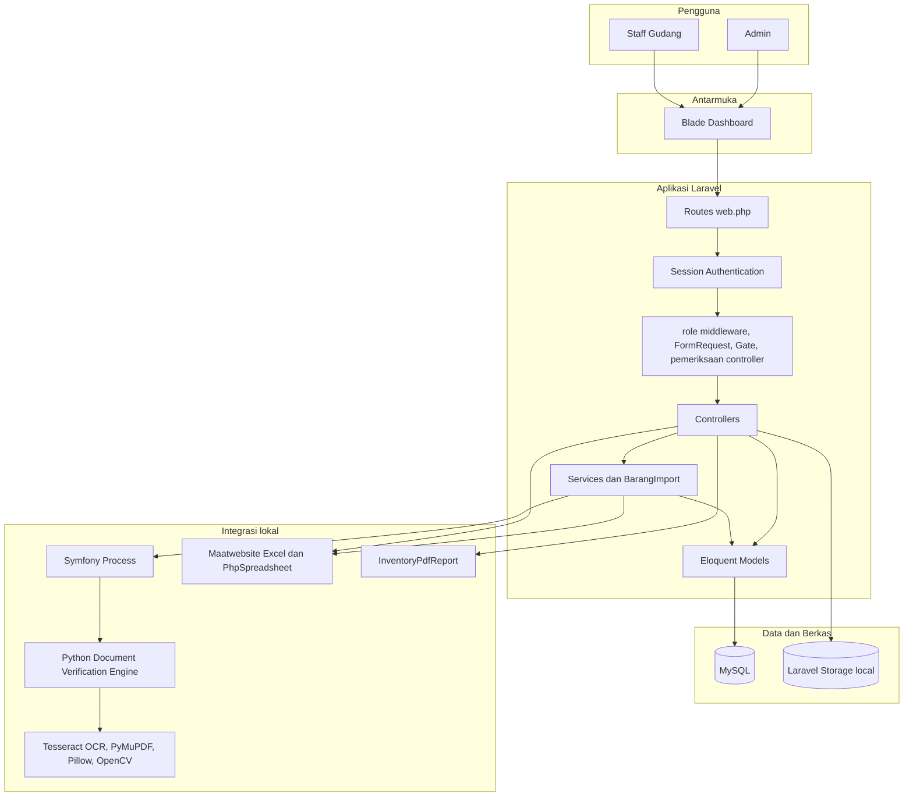
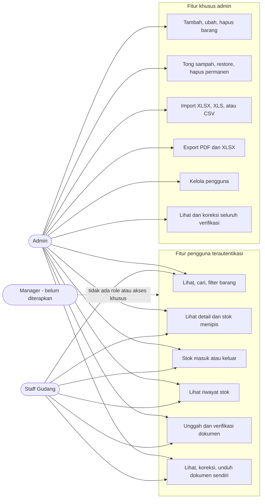
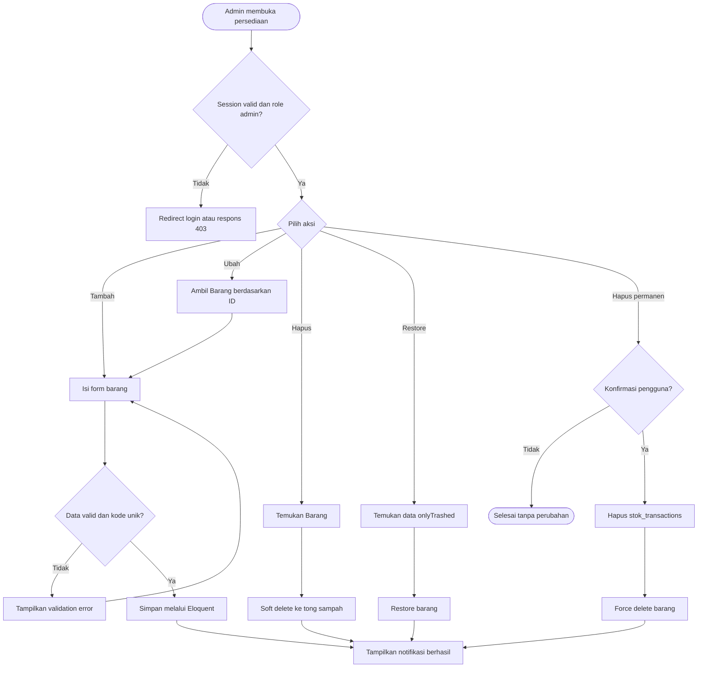
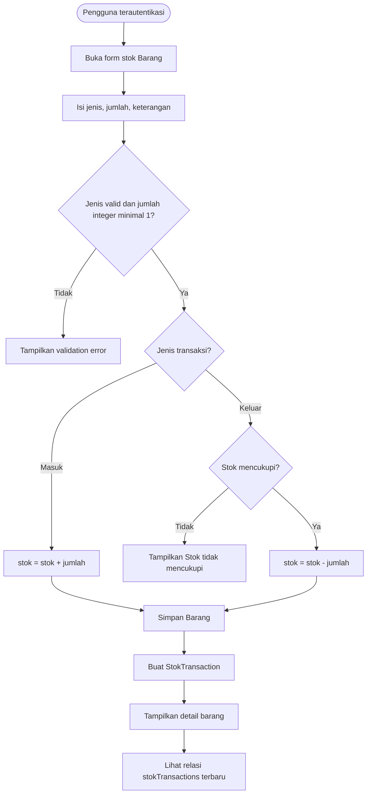
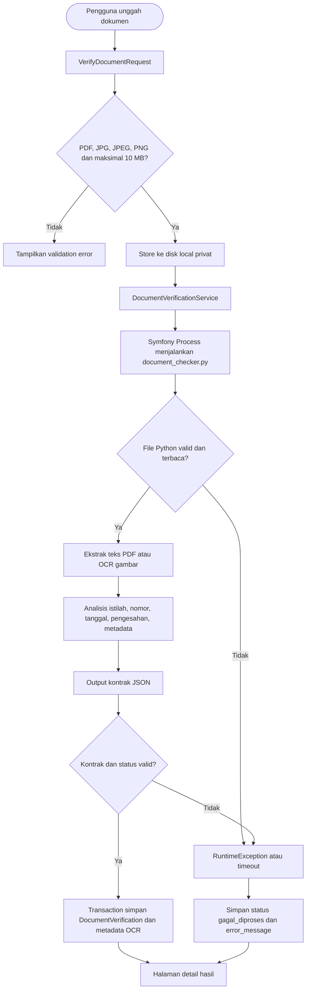
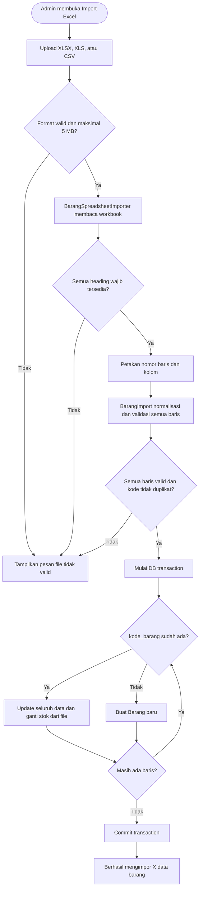
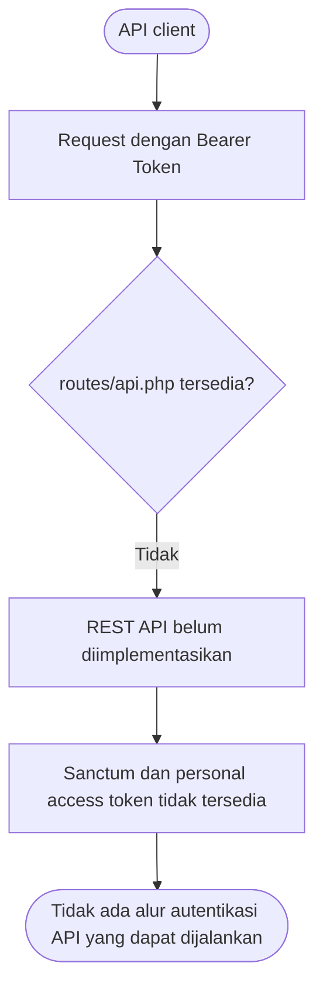
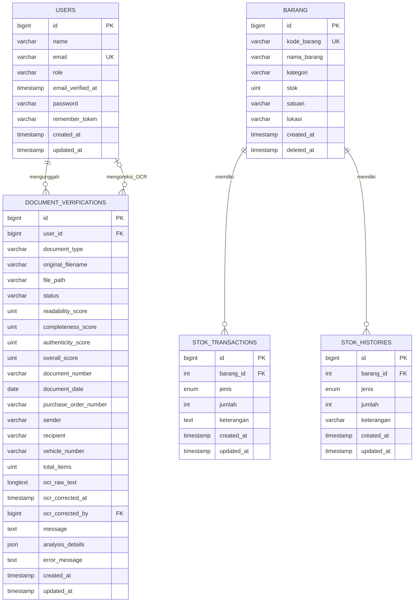

# LogistikKu

LogistikKu adalah aplikasi persediaan berbasis Laravel untuk mengelola barang, pergerakan stok, laporan persediaan, pengguna, import spreadsheet, dan pemeriksaan dokumen berbantuan OCR Python. Antarmuka aplikasi menggunakan Blade dan autentikasi berbasis session.

## Status implementasi yang diaudit

Dokumentasi ini disusun berdasarkan source code yang tersedia, bukan berdasarkan rancangan yang belum diterapkan.

| Komponen | Status aktual |
|---|---|
| Laravel Blade dashboard | Tersedia melalui route web pada `routes/web.php` |
| REST API | Belum tersedia; tidak ditemukan `routes/api.php` atau controller API |
| Bearer token / Laravel Sanctum | Belum tersedia dan tidak tercantum dalam `composer.json` |
| Spatie Permission | Belum tersedia dan tidak tercantum dalam `composer.json` |
| Policy Laravel | Tidak ditemukan class Policy; otorisasi memakai middleware, `FormRequest`, Gate, dan pemeriksaan controller |
| Role | Hanya `admin` dan `staff`; role Manager belum diterapkan |
| Maatwebsite Excel | Versi 3.1 digunakan untuk membaca file import; PhpSpreadsheet menjadi engine spreadsheet dasarnya |
| DomPDF | Tidak terpasang; laporan PDF dibuat oleh `App\Services\InventoryPdfReport` |
| Symfony Process | Digunakan oleh `App\Services\DocumentVerificationService` untuk menjalankan Python |
| Laravel Storage | Digunakan pada disk `local` untuk dokumen verifikasi |

## 1. Diagram Arsitektur Sistem


Infografik di atas menyederhanakan alur sistem untuk pembaca nonteknis. Diagram Mermaid berikut memberikan rincian teknis dari alur yang sama.

### Diagram arsitektur aktual



Pengguna mengakses dashboard Blade melalui route web. Middleware `auth` memastikan session valid, sedangkan `EnsureUserHasRole`, otorisasi `FormRequest`, Gate di `AppServiceProvider`, dan pemeriksaan kepemilikan pada controller membatasi akses. Controller menggunakan Eloquent untuk data, Storage untuk dokumen privat, serta service khusus untuk spreadsheet, PDF, dan verifikasi Python.

> REST API, Sanctum, Spatie Permission, Policy, dan DomPDF tidak dimasukkan sebagai node aktif karena tidak ditemukan dalam implementasi.

## 2. Use Case Diagram

### Use case berdasarkan hak akses aktual



Admin dan staff sama-sama melewati middleware `auth`. Group `role:admin` melindungi pengelolaan barang, pengguna, import, export, dan tong sampah. Route stok masuk/keluar saat ini tersedia bagi seluruh pengguna terautentikasi. Staff hanya melihat riwayat verifikasi miliknya, sedangkan admin melihat semuanya. Manager belum menjadi nilai role atau aturan akses dalam source code.

### Tabel role dan hak akses

| Fitur | Admin | Staff |
|---|:---:|:---:|
| Login dan logout session | Ya | Ya |
| Lihat, cari, filter, dan urutkan barang | Ya | Ya |
| Lihat stok menipis, detail, dan riwayat stok | Ya | Ya |
| Stok masuk atau keluar | Ya | Ya |
| Tambah, edit, soft delete barang | Ya | Tidak |
| Restore dan hapus permanen barang | Ya | Tidak |
| Import dan download template spreadsheet | Ya | Tidak |
| Export laporan PDF dan XLSX | Ya | Tidak |
| Kelola pengguna | Ya | Tidak |
| Unggah dokumen untuk verifikasi | Ya | Ya |
| Lihat semua riwayat verifikasi | Ya | Tidak |
| Lihat, koreksi, dan unduh dokumen sendiri | Ya | Ya |
| Koreksi dan unduh dokumen pengguna lain | Ya | Tidak |

## 3. Activity Diagram / Flowchart

### Aktivitas CRUD barang



Validasi create/update mencakup kode unik, kategori dan satuan standar, serta stok integer minimal nol. Penghapusan biasa menggunakan trait `SoftDeletes`; penghapusan permanen tersedia dari tong sampah.

### Aktivitas stok masuk/keluar dan riwayat



Riwayat yang ditampilkan aplikasi berasal dari model `StokTransaction`. Tabel dan model `StokHistory` juga ada, tetapi controller stok saat ini tidak menulis ke tabel tersebut.

### Aktivitas verifikasi dokumen Laravel–Python



`DocumentVerificationService` menjalankan Python dengan timeout dari `config/services.php`. Engine Python memakai `PyMuPDF`, `Pillow`, `OpenCV`, `pytesseract`, dan instalasi Tesseract sistem. Hasil harus berisi status, confidence, empat skor, catatan, serta bagian analisis `ocr`, `metadata`, `manipulation`, dan `barcode`.

### Aktivitas import Excel dengan validasi dan upsert



Heading wajib adalah `kode_barang`, `nama_barang`, `kategori`, `stok`, `satuan`, dan `lokasi`. Seluruh baris divalidasi sebelum transaction penulisan dimulai sehingga error tidak menghasilkan import parsial.

### Aktivitas autentikasi REST API menggunakan Bearer Token



Diagram ini sengaja menunjukkan kondisi aktual. Aplikasi hanya memiliki autentikasi web berbasis session melalui `AuthController`; tidak ada endpoint penerbit token, middleware `auth:sanctum`, tabel `personal_access_tokens`, atau dependency Sanctum.

## 4. ERD

### ERD tabel domain utama



ERD menampilkan tabel domain yang memiliki model/migration aplikasi. Migration Laravel juga membuat tabel infrastruktur `password_reset_tokens`, `sessions`, `cache`, `cache_locks`, `jobs`, `job_batches`, dan `failed_jobs`; tabel tersebut tidak dimasukkan agar diagram domain tetap terbaca. Kolom `score` lama pada `document_verifications` telah diganti oleh empat kolom skor melalui migration berikutnya.

## 5. Penjelasan Pendukung

### Alur data utama

1. Browser mengirim request ke `routes/web.php`.
2. Middleware `auth` memeriksa session; route administratif juga melewati alias `role` yang mengarah ke `App\Http\Middleware\EnsureUserHasRole`.
3. Controller memvalidasi input langsung atau melalui `FormRequest`.
4. Model Eloquent membaca/menulis MySQL.
5. Dokumen unggahan disimpan pada disk `local` di `storage/app/private/document-verifications/{user_id}`.
6. Proses spreadsheet dan dokumen diteruskan ke service terkait.
7. Hasil dikembalikan ke Blade sebagai halaman, redirect, notifikasi, atau file download.

### Teknologi yang digunakan

| Teknologi | Penggunaan aktual |
|---|---|
| PHP 8.2+ | Runtime aplikasi |
| Laravel 12 | Routing, session auth, validation, Blade, Eloquent, migration, Storage |
| MySQL | Database pada konfigurasi pengembangan proyek |
| Blade dan SkyDash | Dashboard web |
| Bootstrap 5 | Komponen dan pagination UI |
| PhpSpreadsheet 1.30 | Engine XLSX/XLS/CSV, template, dan export XLSX |
| Maatwebsite Excel 3.1 | Membaca workbook pada alur import melalui facade `Excel` |
| Symfony Process | Menjalankan proses Python lokal |
| Python | Engine verifikasi dokumen dan prediksi stok |
| PyMuPDF | Membaca teks dan merender halaman PDF menjadi gambar |
| Pillow | Membuka gambar, normalisasi orientasi, kontras, dan preprocessing OCR/ELA |
| OpenCV | Analisis ELA, kontur, warna cap, tanda tangan, dan kualitas gambar |
| pytesseract dan Tesseract OCR | Ekstraksi teks PDF hasil scan dan gambar |
| scikit-learn | Regresi linear pada engine prediksi stok |
| PHPUnit | Unit dan feature test Laravel |
| Python unittest | Test engine dokumen |
| Laravel Pint | Formatter PHP |

Laporan PDF tidak memakai DomPDF. File dibuat langsung oleh `App\Services\InventoryPdfReport` sebagai dokumen PDF 1.4.

### Struktur folder penting

```text
app/
├── Http/Controllers/       Controller web, import, laporan, trash, user
├── Http/Middleware/        Middleware role
├── Http/Requests/          Otorisasi dan validasi upload/metadata
├── Imports/                Validasi dan upsert baris Barang
├── Jobs/                   Pekerjaan OCR melalui antrean Laravel
├── Models/                 Model Eloquent domain
├── Providers/              Gate dan konfigurasi pagination
└── Services/               Spreadsheet, PDF, dan proses Python
database/
└── migrations/             Definisi dan perubahan skema
python/
├── document_checker.py     CLI verifikasi dokumen
├── requirements.txt        Dependency Python
└── tests/                  Test engine Python
resources/views/            Blade dashboard dan komponen UI
routes/web.php              Seluruh endpoint aplikasi saat ini
storage/app/private/        Penyimpanan dokumen verifikasi
tests/Feature/              Pengujian alur HTTP
tests/Unit/                 Pengujian kontrak/service
```

### Integrasi Laravel–Python

1. `VerifyDocumentRequest` menerima tipe dokumen dan file maksimal 10 MB.
2. `DocumentVerificationController` menyimpan file pada disk `local`.
3. Controller membuat riwayat berstatus `menunggu`, mencegah upload ganda dalam jeda singkat, lalu mengirim `ProcessDocumentVerification` ke antrean.
4. Queue worker mengubah status menjadi `sedang_dianalisis` dan menjalankan `DocumentVerificationService`.
5. Symfony Process menjalankan Python dengan timeout `DOCUMENT_CHECKER_TIMEOUT`.
6. Python memvalidasi file, mengekstrak teks, menjalankan OCR bila perlu, menghitung skor, lalu mencetak JSON ASCII-safe.
7. Laravel memvalidasi kontrak JSON dan menyimpan hasil melalui `DocumentVerificationResultWriter`.
8. Halaman status melakukan polling ringan sampai proses selesai atau gagal. Tanpa JavaScript, status tetap tersedia setelah halaman dimuat ulang.
9. Timeout, kegagalan proses, atau kontrak tidak valid disimpan sebagai `gagal_diproses` beserta pesan aman.

Jalankan queue worker bersama aplikasi agar pekerjaan OCR diproses. Batas worker dibuat lebih panjang daripada batas proses Python agar dokumen besar tidak diambil oleh dua worker:

```bash
php artisan queue:work database --queue=default --sleep=1 --tries=1 --timeout=300
```

Perintah `composer run dev` juga menjalankan listener antrean. Pada Windows/XAMPP, worker dapat dijalankan otomatis melalui Task Scheduler dengan executable PHP, argument di atas, dan `Start in` yang menunjuk direktori root proyek.

### Cara kerja import spreadsheet

1. `ImportBarangRequest` membatasi akses ke admin dan menerima XLSX, XLS, atau CSV maksimal 5 MB.
2. `BarangSpreadsheetImporter` memakai facade Maatwebsite Excel untuk membaca sheet aktif menjadi array; paket menggunakan PhpSpreadsheet sebagai engine.
3. Heading dinormalisasi dan diperiksa terhadap `BarangImport::COLUMNS`.
4. `BarangImport` membersihkan spasi, menormalkan kapitalisasi kategori/satuan, memvalidasi setiap baris, dan mendeteksi kode duplikat dalam file.
5. Dalam satu `DB::transaction`, `Barang::firstOrNew` membuat barang baru atau memperbarui barang lama. Nilai stok diganti oleh nilai file, bukan ditambahkan.
6. Controller menampilkan jumlah total data yang berhasil diimpor.

### Requirement aplikasi

| Komponen | Requirement aktual |
|---|---|
| PHP | PHP `^8.2`, sesuai `composer.json` |
| Laravel | Laravel `^12.0` |
| Composer | Diperlukan untuk memasang dependency PHP |
| Database | MySQL untuk penggunaan normal; SQLite in-memory digunakan otomatis oleh PHPUnit |
| Python | Python 3.10 atau lebih baru direkomendasikan |
| OCR sistem | Tesseract OCR harus terpasang dan tersedia pada `PATH`, atau path executable diatur melalui `TESSERACT_CMD` |

Dependency Python aktual berada di `python/requirements.txt`:

- `PyMuPDF`: membaca teks PDF dan merender halaman PDF menjadi gambar.
- `Pillow`: membuka gambar, memperbaiki orientasi/kontras, serta mendukung preprocessing OCR dan ELA.
- `pytesseract`: penghubung Python ke program Tesseract OCR.
- `opencv-python`: analisis citra, ELA, deteksi kandidat cap/tanda tangan, dan pengukuran kualitas gambar.
- `scikit-learn`: model regresi linear untuk prediksi kebutuhan stok ketika riwayat transaksi mencukupi.

Proyek menggunakan `PyMuPDF`, bukan `pypdf`, untuk pemrosesan PDF. Paket `pytesseract` hanya merupakan penghubung; program **Tesseract OCR tetap harus dipasang terpisah** pada sistem operasi. Engine memilih bahasa `ind+eng` ketika kedua data bahasa tersedia dan menggunakan salah satunya jika hanya satu yang terpasang.

Versi dependency yang digunakan proyek dapat dipasang sekaligus dengan:

```powershell
python -m pip install -r python\requirements.txt
```

Saat dijalankan dari root proyek, engine verifikasi dapat diuji langsung tanpa Laravel:

```powershell
python python\document_checker.py "C:\path\ke\invoice.pdf" --document-type invoice
python python\document_checker.py "C:\path\ke\surat-jalan.jpg" --document-type surat_jalan
python python\document_checker.py "C:\path\ke\bukti.png" --document-type bukti_fisik
```

Engine menulis satu objek JSON ke standard output. Laravel membaca output tersebut melalui Symfony Process. Jangan menambahkan teks debug biasa ke standard output; gunakan logging yang aman agar kontrak JSON tidak rusak.

### Kemampuan engine verifikasi dokumen

`python/document_checker.py` menerima PDF, JPG, JPEG, atau PNG dan menjalankan kombinasi pemeriksaan berikut:

1. Validasi format, ukuran, dan keterbacaan file.
2. Ekstraksi teks PDF atau OCR gambar menggunakan Tesseract.
3. Ekstraksi metadata sesuai jenis dokumen: Surat Jalan, Invoice, atau Bukti Fisik.
4. Pemeriksaan konsistensi isi, misalnya kesesuaian DPP, pajak, dan total Invoice.
5. Error Level Analysis (ELA) untuk menemukan perbedaan pola kompresi pada area sensitif seperti tanggal dan nominal.
6. Deteksi kandidat cap dan tanda tangan menggunakan analisis warna, kontur, dan bentuk OpenCV.
7. Penggabungan indikator menjadi skor keterbacaan, kelengkapan, keaslian, skor keseluruhan, dan status `ASLI`, `MENCURIGAKAN`, atau `PALSU`.

Status `ASLI` berarti engine tidak menemukan indikasi manipulasi kuat berdasarkan pemeriksaan otomatis. Status tersebut bukan jaminan keaslian hukum dan tetap dapat memerlukan pemeriksaan manusia.

### Instalasi Laravel

Jalankan dari direktori root project:

```powershell
composer install
Copy-Item .env.example .env
php artisan key:generate
php artisan migrate
php artisan serve
```

Sesuaikan konfigurasi `DB_*` pada `.env` sebelum menjalankan migration apabila menggunakan MySQL. Jangan menggunakan database development untuk automated test; `phpunit.xml` telah mengatur `DB_CONNECTION=sqlite` dan `DB_DATABASE=:memory:`.

### Virtual environment Python di Windows

PowerShell:

```powershell
Set-Location python
py -3.10 -m venv .venv
.\.venv\Scripts\Activate.ps1
python -m pip install --upgrade pip
python -m pip install -r requirements.txt
```

Verifikasi instalasi library dan Tesseract:

```powershell
python -c "import cv2, fitz, PIL, pytesseract, sklearn; print('Library Python tersedia')"
tesseract --version
tesseract --list-langs
```

Command Prompt:

```bat
cd python
py -3.10 -m venv .venv
.venv\Scripts\activate.bat
python -m pip install -r requirements.txt
```

Untuk keluar dari virtual environment, jalankan `deactivate`.

### Konfigurasi executable Python

Konfigurasi tanpa credential tersedia di `.env.example`:

```dotenv
PYTHON_EXECUTABLE=python
DOCUMENT_CHECKER_TIMEOUT=120
```

Jika memakai virtual environment Windows, nilai tersebut dapat diarahkan secara eksplisit:

```dotenv
PYTHON_EXECUTABLE=C:\path\ke\project\python\.venv\Scripts\python.exe
DOCUMENT_CHECKER_TIMEOUT=120
```

Ketika `PYTHON_EXECUTABLE` tidak diisi, `config/services.php` otomatis memakai `python/.venv/Scripts/python.exe` jika file tersebut tersedia; jika tidak, perintah `python` dari `PATH` digunakan.

### Menjalankan aplikasi dan engine Python

Jalankan Laravel dari root project:

```powershell
php artisan serve
```

Engine juga dapat diperiksa langsung tanpa Laravel:

```powershell
python python/document_checker.py "C:\dokumen\invoice.pdf" --document-type invoice
python python/document_checker.py "C:\dokumen\surat-jalan.jpg" --document-type surat_jalan
python python/document_checker.py "C:\dokumen\bukti-penerimaan.png" --document-type bukti_fisik
```

Nilai `--document-type` yang tersedia adalah `surat_jalan`, `invoice`, dan `bukti_fisik`. Program menulis satu objek JSON ke standard output. Contoh kontrak ringkas:

```json
{
  "status": "MENCURIGAKAN",
  "confidence": 74.0,
  "notes": "Dokumen memerlukan peninjauan lebih lanjut.",
  "scores": {
    "readability_score": 100,
    "completeness_score": 68,
    "authenticity_score": 50,
    "overall_score": 74
  },
  "analysis": {
    "ocr": {"text_detected": true, "document_number": "INV-001"},
    "metadata": {"analyzed": true, "fields": {"currency": "IDR"}},
    "manipulation": {"analyzed": false, "findings": []},
    "barcode": {"detected": false, "decoded": false, "value": null}
  }
}
```

Nilai contoh hanya menggambarkan struktur respons, bukan jaminan skor suatu dokumen.

### Alur Laravel ke Python

1. `VerifyDocumentRequest` memvalidasi tipe dokumen, ekstensi, dan ukuran maksimal 10 MB.
2. `DocumentVerificationController` menyimpan file privat melalui Laravel Storage.
3. `DocumentVerificationService` menjalankan `python/document_checker.py` melalui Symfony Process dengan batas waktu yang dikonfigurasi.
4. Python membaca PDF atau gambar, menjalankan OCR bila diperlukan, lalu mengirim JSON melalui standard output.
5. Laravel memvalidasi `status`, `confidence`, `notes`, skor, serta struktur `analysis`.
6. Hasil valid disimpan ke `document_verifications` dan ditampilkan pada Blade. Kegagalan ditampilkan sebagai pesan aman tanpa stack trace.

### Menjalankan test dan formatter

Seluruh feature/unit test Laravel:

```powershell
php artisan test
```

Suite tertentu:

```powershell
php artisan test --filter=DocumentVerificationTest
php artisan test --filter=BarangImportTest
```

Test engine Python dan pemeriksaan format PHP:

```powershell
Set-Location python
python -m unittest discover -s tests -p "test_*.py" -v
Set-Location ..
vendor\bin\pint --test app routes tests
```

Test wajib Modul 7 tersedia pada:

- `tests/Feature/DocumentVerificationTest.php`: upload, validasi, otorisasi, penyimpanan hasil Python, proses ulang OCR, pemetaan/koreksi metadata, dan tampilan status hasil verifikasi.
- `tests/Feature/BarangImportTest.php`: download template, import barang baru, update barang lama, validasi per baris, penolakan duplikat, file invalid, serta pembatasan akses.
- `tests/Feature/DocumentVerificationAuditNotificationTest.php`: notifikasi OCR berhasil/gagal, idempotensi retry, authorization, mark as read, audit koreksi, dan kompatibilitas riwayat lama.
- `python/tests/test_document_checker.py`: kontrak JSON, OCR dan ekstraksi metadata, analisis ELA, serta deteksi cap/tanda tangan.

Automated test memakai fixture atau mock. Pengujian manual dengan dokumen simulasi tetap disarankan untuk menilai kualitas OCR pada scan, tulisan tangan, dan template eksternal yang bervariasi.

Feature test memakai `RefreshDatabase` dan SQLite `:memory:` dari `phpunit.xml`, sehingga data database development tidak dibaca atau diubah. Service verifikasi Python di-mock pada feature test agar PHPUnit tidak bergantung pada instalasi Python atau Tesseract lokal.

## Catatan pengembangan lanjutan

Komponen berikut belum dapat didokumentasikan sebagai fitur aktif karena tidak ditemukan di source code:

- REST API dan `routes/api.php`.
- Autentikasi Bearer Token dan Laravel Sanctum.
- Spatie Laravel Permission beserta tabel role/permission-nya.
- Class Policy pada `app/Policies`.
- Role Manager.
- DomPDF.

Jika komponen tersebut ditambahkan kemudian, diagram arsitektur, use case, flow autentikasi API, ERD, dan tabel hak akses perlu diperbarui mengikuti implementasi nyata.

## License

Project menggunakan Laravel Framework yang berlisensi [MIT](https://opensource.org/licenses/MIT).
