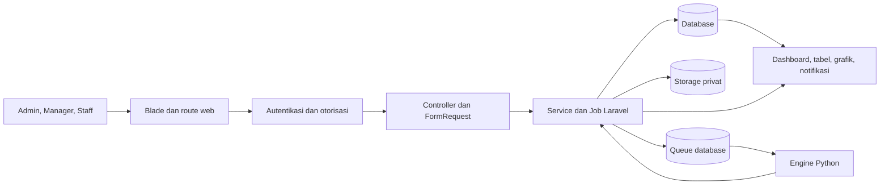
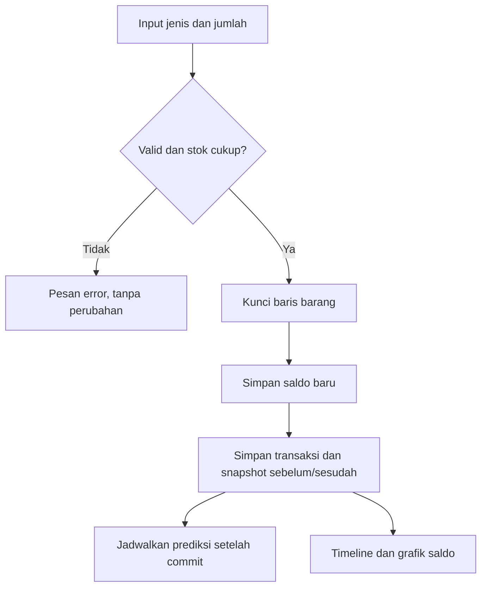
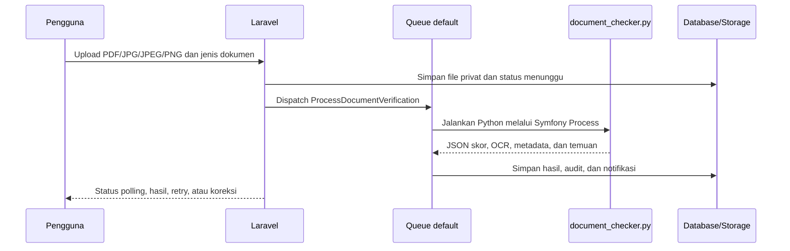
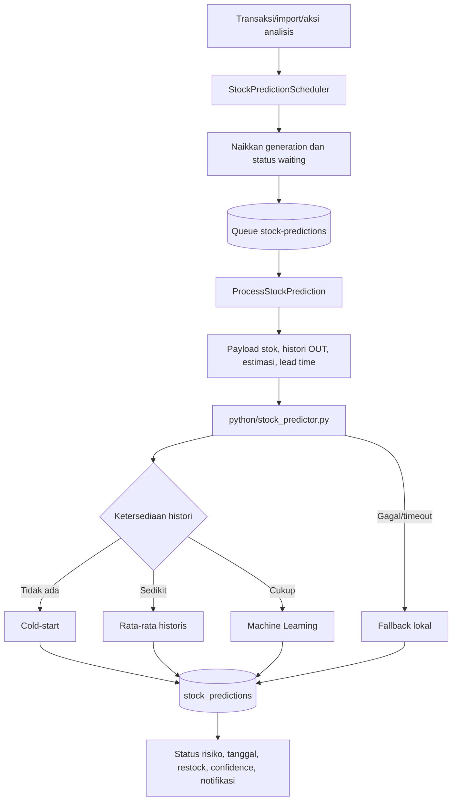

# Peta Konsep LogistikKu

Dokumen ini menjelaskan hubungan antara kebutuhan pengguna, proses Laravel/Python, data, dan hasil yang terlihat. Referensi mengarah ke file source aktual.

## Gambaran utama

Intinya: browser tidak berbicara langsung dengan database atau Python. Laravel memvalidasi akses dan input, service menjaga proses bisnis, queue menjalankan pekerjaan berat, lalu hasil disimpan dan ditampilkan kembali.

## 1. Login dan hak akses

| Bagian | Penjelasan |
|---|---|
| Masalah pengguna | Sistem persediaan tidak boleh terbuka untuk pengguna yang tidak berhak. |
| Tujuan | Membuat session aman dan membatasi tindakan menurut role. |
| Aktor | Admin, Manager, Staff Gudang (`staff`). |
| Input | Email, password, opsi ingat saya. |
| Proses | `AuthController` menormalkan email, memeriksa rate limit, menjalankan `Auth::attempt`, lalu meregenerasi session. Middleware dan Gate memeriksa role/kemampuan. |
| Database | `users`; cache rate limit memakai cache store yang dikonfigurasi. |
| Output | Redirect ke daftar barang atau pesan login/rate-limit yang aman. |
| Berhasil/gagal | Berhasil bila kredensial benar dan database tersedia. Gagal bila input salah, limit tercapai, atau koneksi database bermasalah. |
| Inti | Role bukan sekadar label UI; route, request, Gate, dan kepemilikan dokumen tetap memeriksa akses di server. |
| Referensi | `app/Http/Controllers/AuthController.php`, `app/Providers/AppServiceProvider.php`, `app/Http/Middleware/EnsureUserHasRole.php`, `routes/web.php`. |

## 2. Barang, pencarian, dan CRUD

| Bagian | Penjelasan |
|---|---|
| Masalah pengguna | Data barang sulit ditemukan dan rawan tidak konsisten. |
| Tujuan | Menyediakan daftar, pencarian/filter instan, tambah, ubah, foto, dan penghapusan yang dapat dipulihkan. |
| Aktor | Semua role melihat/mencari; hanya Admin melakukan CRUD/trash. |
| Input | Nama, kategori, stok awal, satuan, lokasi, foto, estimasi pemakaian harian, lead time; kata pencarian/filter/sort. |
| Proses | FormRequest memvalidasi; generator membuat kode `BRG-######`; filter memakai query Eloquent dan endpoint partial; delete memakai `SoftDeletes`. |
| Database | `barang`. Foto disimpan pada disk `public`. |
| Output | Daftar paginated, hasil filter instan, detail barang, form, dan trash. |
| Berhasil/gagal | Berhasil bila data valid dan kode unik. Error validasi tampil tanpa perubahan parsial. |
| Inti | Update barang tidak mengubah stok langsung; stok berubah melalui alur transaksi khusus. |
| Referensi | `BarangController.php`, `InventoryFilterRequest.php`, `BarangCodeGenerator.php`, `Barang.php`, `resources/views/barang/`, `public/assets/js/inventory-filter.js`. |

## 3. Stok masuk, stok keluar, dan histori

| Bagian | Penjelasan |
|---|---|
| Masalah pengguna | Saldo dapat salah bila dua transaksi terjadi bersamaan atau histori tidak dapat diaudit. |
| Tujuan | Mengubah stok secara atomik dengan jejak saldo sebelum/sesudah. |
| Aktor | Admin, Manager, Staff Gudang. |
| Input | Jenis `masuk`/`keluar`, jumlah positif, keterangan opsional. |
| Proses | Database transaction dan `lockForUpdate`; stok keluar ditolak bila tidak cukup; prediksi dijadwalkan setelah commit. |
| Database | `barang`, `stok_transactions`, `stock_prediction_processes`, `jobs`. |
| Output | Stok baru, transaksi, timeline, tabel alternatif, dan grafik snapshot. |
| Berhasil/gagal | Berhasil bila aturan stok terpenuhi. Gagal akan rollback. Snapshot legacy null ditandai, bukan direkonstruksi. |
| Inti | Constraint database menjadi lapisan terakhir untuk mencegah stok, jumlah, atau perhitungan snapshot invalid. |
| Referensi | `StockAdjustmentService.php`, `BarangController.php`, `StokTransaction.php`, migration `2026_09_02_020000_*`, `riwayat-stok.blade.php`, `stock-history.js`. |

## 4. Import dan export

| Bagian | Penjelasan |
|---|---|
| Masalah pengguna | Memasukkan atau membagikan banyak data barang satu per satu tidak efisien. |
| Tujuan | Import tervalidasi dan export laporan yang konsisten. |
| Aktor | Admin. |
| Input | XLSX/XLS/CSV maksimal 5 MB dengan kolom kode, nama, kategori, stok, satuan, lokasi. |
| Proses | Spreadsheet dibaca, seluruh baris dinormalisasi/divalidasi, lalu di-upsert dalam transaction. Export menyusun XLSX atau PDF internal. |
| Database | `barang`; import menjadwalkan prediksi melalui queue setelah berhasil. |
| Output | Ringkasan import, template XLSX, laporan XLSX, laporan PDF. |
| Berhasil/gagal | File/baris invalid menolak import tanpa hasil parsial. Kode existing diperbarui; kode baru dibuat. |
| Inti | Import mengganti nilai stok dari file, bukan menambahkannya sebagai transaksi masuk. |
| Referensi | `BarangImportController.php`, `BarangReportController.php`, `BarangSpreadsheetImporter.php`, `BarangImport.php`, `InventoryPdfReport.php`. |

## 5. Dashboard dan Pusat Perhatian

| Bagian | Penjelasan |
|---|---|
| Masalah pengguna | Angka total saja tidak menunjukkan tindakan yang perlu diprioritaskan. |
| Tujuan | Merangkum persediaan, aktivitas, dan perhatian operasional. |
| Aktor | Semua role; item aksi menyesuaikan permission. |
| Input | Data barang, transaksi, hasil prediksi, periode 7 atau 30 hari. |
| Proses | Service menghitung kartu, seri transaksi masuk/keluar, dan daftar perhatian. Endpoint aktivitas hanya menerima periode yang valid. |
| Database | `barang`, `stok_transactions`, `stock_predictions`, proses/notifikasi terkait. |
| Output | Kartu ringkasan, grafik Chart.js, tabel alternatif, dan Pusat Perhatian. |
| Berhasil/gagal | Grafik memiliki loading/empty/error state; data perhatian kosong ditampilkan secara eksplisit. |
| Inti | Dashboard bersifat read-only dan tidak menjalankan prediksi saat dibuka. |
| Referensi | `InventoryDashboardService.php`, `DashboardActivityRequest.php`, `BarangController.php`, `barang/index.blade.php`, `inventory-dashboard.js`. |

## 6. Verifikasi dokumen Laravel–Python

| Bagian | Penjelasan |
|---|---|
| Masalah pengguna | Pemeriksaan dokumen manual lambat dan metadata scan sering tidak rapi. |
| Tujuan | Memberi bantuan OCR, ekstraksi metadata, skor, indikasi manipulasi, dan jejak audit. |
| Aktor | Semua role mengunggah/melihat milik sendiri; Admin dapat melihat semua. |
| Input | Jenis `surat_jalan`, `invoice`, atau `bukti_fisik`; PDF/JPG/JPEG/PNG maksimal 10 MB. |
| Proses Laravel/Python | Laravel menyimpan file privat dan dispatch job unik. Python memakai PyMuPDF/Pillow/OpenCV/pytesseract, lalu Laravel memvalidasi kontrak JSON dan menyimpan hasil. |
| Database | `document_verifications`, audit, notifications; file pada `storage/app/private/document-verifications/{user_id}`. |
| Output | Status, empat skor, OCR/metadata, catatan, audit, notifikasi, download, koreksi, retry/reprocess. |
| Berhasil/gagal | Timeout/kontrak invalid/file hilang menghasilkan status gagal dan pesan aman. Retry memerlukan file masih tersedia. |
| Inti | Status otomatis bukan jaminan keaslian hukum; hasil perlu konteks dan pemeriksaan manusia. Worker queue `default` harus aktif. |
| Referensi | `DocumentVerificationController.php`, `ProcessDocumentVerification.php`, `DocumentVerificationService.php`, `DocumentVerificationResultWriter.php`, `python/document_checker.py`, `resources/views/verifications/`. |

## 7. Prediksi stok dan queue

| Bagian | Penjelasan |
|---|---|
| Masalah pengguna | Pengguna perlu mengetahui risiko kehabisan dan perkiraan kebutuhan sebelum terlambat restock. |
| Tujuan | Mengubah histori OUT dan input awal menjadi rekomendasi yang dapat ditinjau. |
| Aktor | Semua role melihat hasil; Admin/Manager menjalankan analisis dan menyetujui restock. |
| Input | Stok kini, histori OUT, minimum stok, estimasi pemakaian harian, lead time, horizon/minimum histori. |
| Proses Laravel/Python | Scheduler menjaga satu proses per barang dan generation terbaru. Job memakai `WithoutOverlapping`. Python memilih cold-start/rata-rata/ML; Laravel memakai fallback lokal bila Python gagal. |
| Database | `stock_predictions`, `stock_prediction_processes`, `jobs`, `failed_jobs`, notifikasi dan receipt pengguna. |
| Output | Risiko Aman/Waspada/Perlu Restock/Mendesak/Perlu Ditinjau, kebutuhan 30 hari, tanggal, safety stock, restock, metode, confidence, alasan, status proses. |
| Berhasil/gagal | Job selesai menyimpan prediksi dan status completed. Retry hingga tiga kali; kegagalan akhir menjadi failed. Data berubah saat analisis berjalan akan menjadwalkan generation terbaru. |
| Inti | Worker queue `stock-predictions` harus aktif. Status Menunggu sendiri tidak membuktikan worker offline. Prediksi tidak mengubah stok; persetujuan hanya membuka form stok masuk. |
| Referensi | `StockPredictionScheduler.php`, `ProcessStockPrediction.php`, `StockPredictionService.php`, `StockPredictionController.php`, `StockPredictionPresenter.php`, `python/stock_predictor.py`, `stock-predictions/index.blade.php`. |

## 8. Notifikasi per pengguna

| Bagian | Penjelasan |
|---|---|
| Masalah pengguna | Status penting dapat terlewat bila hanya terlihat pada halaman sumber. |
| Tujuan | Menyampaikan hasil OCR dan perubahan risiko prediksi kepada pengguna yang tepat. |
| Aktor | Pengguna terautentikasi. |
| Input | Hasil job dokumen atau prediksi baru berstatus restock/mendesak. |
| Proses | Service/job membuat notifikasi; prediksi memakai receipt per pengguna agar status baca tidak dibagi bersama. |
| Database | `notifications`, `stock_prediction_notifications`, `stock_prediction_notification_reads`. |
| Output | Badge jumlah, daftar notifikasi, buka hasil, tandai satu/semua dibaca. |
| Berhasil/gagal | Kegagalan notifikasi OCR dicatat ke log dan tidak menggagalkan hasil OCR. Akses notifikasi prediksi memeriksa receipt pengguna. |
| Inti | Status sudah dibaca adalah milik masing-masing pengguna. |
| Referensi | `AppServiceProvider.php`, `DocumentVerificationNotificationService.php`, controller notifikasi OCR/prediksi, model notifikasi dan receipt. |

## Ringkasan data aktif

| Kelompok | Tabel utama |
|---|---|
| Identitas/infrastruktur | `users`, `password_reset_tokens`, `sessions`, `cache`, `cache_locks` |
| Barang/stok | `barang`, `stok_transactions`; `stok_histories` adalah tabel legacy |
| Queue | `jobs`, `job_batches`, `failed_jobs` |
| Verifikasi | `document_verifications`, `document_verification_audits`, `notifications` |
| Prediksi | `stock_predictions`, `stock_prediction_processes`, `stock_prediction_notifications`, `stock_prediction_notification_reads` |

## Prinsip yang harus diingat

1. Gunakan transaksi stok untuk mengubah saldo, bukan edit barang.
2. Jalankan worker `default` untuk OCR dan `stock-predictions` untuk prediksi.
3. Jangan menganggap confidence sebagai kepastian.
4. Jangan merekonstruksi snapshot histori lama yang memang tidak tersedia.
5. Jangan menyimpan `.env`, dokumen privat, log, cache, atau database backup di Git.
6. Jalankan migration biasa dan test; jangan memakai `migrate:fresh` pada data yang perlu dipertahankan.
