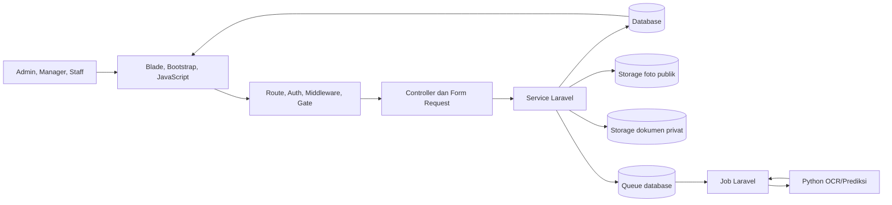
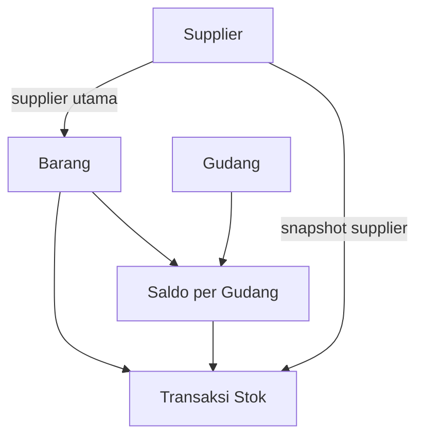
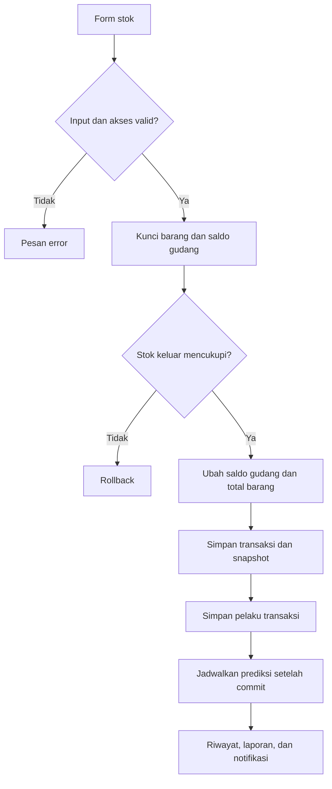
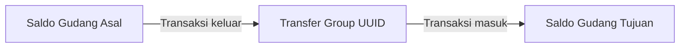
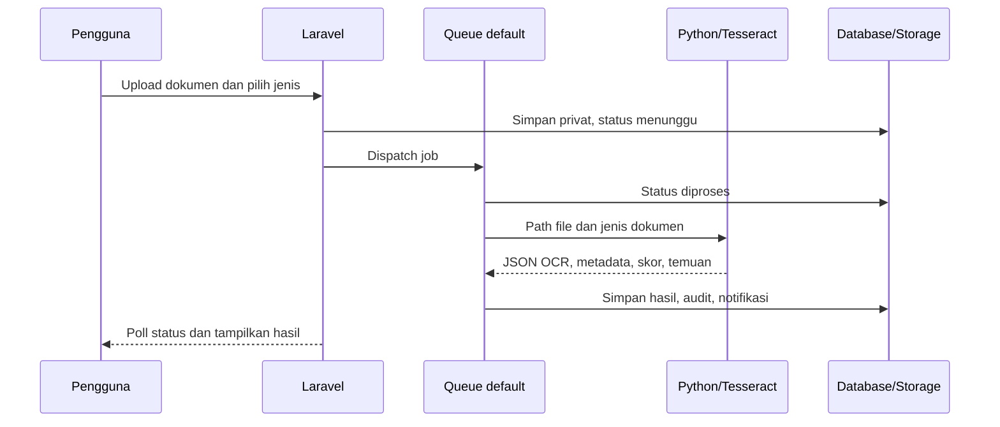
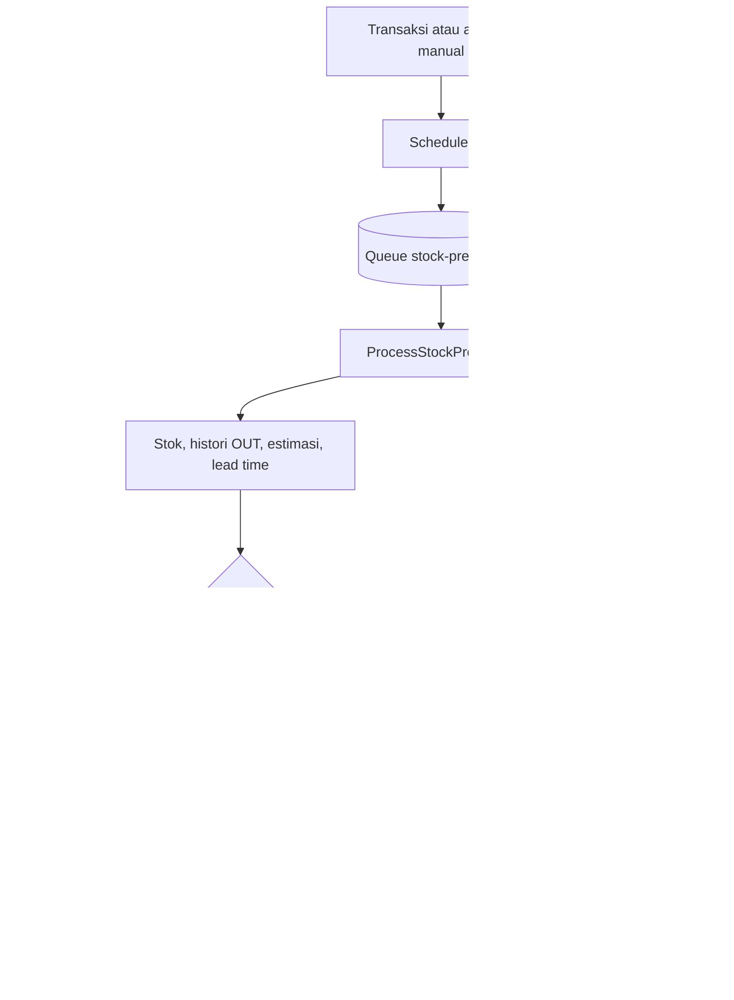

# Peta Konsep LogistikKu

Dokumen ini menjelaskan tujuan dan cara kerja seluruh fitur LogistikKu. Detail kebutuhan formal berada di [SRS](./srs.md), sedangkan struktur data berada di [ERD](./database/erd.md) dan [Data Dictionary](./data_dictionary.md).

## 1. Arsitektur aplikasi


```mermaid
flowchart LR
    U[Admin, Manager, Staff] --> UI[Blade, Bootstrap, JavaScript]
    UI --> MW[Route, Auth, Middleware, Gate]
    MW --> C[Controller dan Form Request]
    C --> S[Service Laravel]
    S --> DB[(Database)]
    S --> PUB[(Storage foto publik)]
    S --> PRI[(Storage dokumen privat)]
    S --> Q[(Queue database)]
    Q --> J[Job Laravel]
    J --> PY[Python OCR/Prediksi]
    PY --> J
    DB --> UI
```

Browser tidak mengakses database atau Python secara langsung. Laravel memeriksa autentikasi, hak akses, dan input; service menjalankan aturan bisnis; queue memproses pekerjaan berat; hasil disimpan lalu ditampilkan melalui Blade atau endpoint JSON internal.

## 2. Login dan hak akses

| Bagian | Kegunaan |
|---|---|
| Login | Membuat session pengguna dengan email dan password. |
| Normalisasi | Email dipangkas dan diubah menjadi huruf kecil. |
| Perlindungan | Maksimal lima kegagalan per kombinasi email/IP selama 60 detik. |
| Remember-me | Mempertahankan login pada perangkat pengguna bila dipilih. |
| Logout | Menghapus session dan mengganti token CSRF. |
| Role | Admin, Manager, dan Staff menentukan fitur yang dapat dijalankan. |

Kredensial demo tidak ditampilkan pada halaman login. Middleware `auth`, middleware `role`, Laravel Gate, Form Request, dan pemeriksaan kepemilikan dokumen tetap menegakkan akses di server.

## 3. Master barang, supplier, dan gudang


```mermaid
flowchart TD
    S[Supplier] -->|supplier utama| B[Barang]
    B --> WS[Saldo per Gudang]
    W[Gudang] --> WS
    B --> T[Transaksi Stok]
    WS --> T
    S -->|snapshot supplier| T
```

### Barang

- Menyimpan kode otomatis `BRG-######`, nama, kategori, satuan, lokasi, stok total, harga beli, foto, estimasi pemakaian harian, dan lead time.
- Semua role dapat melihat, mencari, memfilter, dan membuka detail.
- Admin dapat menambah, mengubah, soft delete, restore, dan menghapus permanen jika tidak memiliki dependensi.
- Stok tidak diubah dari form edit barang; perubahan harus melalui transaksi stok.

### Supplier

- Menyimpan kode, nama, narahubung, telepon, email, alamat, dan status aktif.
- Dapat menjadi supplier utama barang dan snapshot supplier transaksi.
- Semua role dapat melihat daftar/detail; Admin dapat CRUD.
- Soft delete mempertahankan histori. Force delete mengosongkan FK nullable.

### Gudang

- Menyimpan kode, nama, alamat, catatan, status aktif, dan soft delete.
- Migration menyediakan `GDG-UTAMA`, `GDG-A`, `GDG-B`, dan `GDG-C` secara aman/idempoten.
- `warehouse_stocks` menyimpan saldo unik setiap pasangan barang-gudang.
- Semua role dapat melihat daftar/detail saldo; Admin dapat CRUD master.

## 4. Stok masuk dan keluar


```mermaid
flowchart TD
    F[Form stok] --> V{Input dan akses valid?}
    V -- Tidak --> E[Pesan error]
    V -- Ya --> L[Kunci barang dan saldo gudang]
    L --> C{Stok keluar mencukupi?}
    C -- Tidak --> R[Rollback]
    C -- Ya --> U[Ubah saldo gudang dan total barang]
    U --> T[Simpan transaksi dan snapshot]
    T --> A[Simpan pelaku transaksi]
    A --> P[Jadwalkan prediksi setelah commit]
    P --> H[Riwayat, laporan, dan notifikasi]
```

Input dapat mencakup jenis masuk/keluar, jumlah, gudang, supplier, harga satuan, keterangan, tipe/nomor/tanggal referensi, dan dokumen pendukung. Proses memakai transaksi database dan `lockForUpdate()` untuk mencegah kehilangan pembaruan.

Data penting yang dicatat:

- barang dan saldo gudang terkait;
- jenis dan jumlah mutasi;
- supplier saat transaksi;
- stok sebelum/sesudah;
- harga satuan dan sumber harga;
- referensi dokumen dan file;
- pengguna yang menjalankan transaksi;
- waktu pembuatan.

## 5. Transfer antargudang

Transfer memindahkan stok barang dari satu gudang ke gudang lain tanpa mengubah total `barang.stok`.


```mermaid
flowchart LR
    A[Saldo Gudang Asal] -->|Transaksi keluar| G[Transfer Group UUID]
    G -->|Transaksi masuk| B[Saldo Gudang Tujuan]
```

Aturan utama:

- gudang asal dan tujuan harus berbeda dan aktif;
- jumlah harus positif dan tidak melebihi saldo asal;
- dua transaksi dibuat secara atomik dengan `transfer_group_uuid` yang sama;
- jika salah satu langkah gagal, seluruh transfer dibatalkan;
- semua role dapat melakukan transfer karena termasuk kemampuan memperbarui stok.

## 6. Reversal transaksi

Reversal membalik efek transaksi yang salah tanpa menghapus histori.

- Hanya Admin dan Manager.
- Transaksi yang sudah direversal tidak dapat dibalik lagi.
- Sistem membuat transaksi lawan dan menghubungkannya melalui `reversal_of_id`.
- Transaksi asli mencatat `reversed_at` serta `reversed_by`.
- Alasan reversal wajib dicatat.
- Reversal transfer mempertahankan jejak pasangan transfer dan integritas saldo.

## 7. Riwayat dan audit stok

Halaman riwayat menyediakan timeline, tabel berhalaman, grafik snapshot, gudang, supplier, jenis mutasi, pelaku, referensi, serta status reversal. `stok_transactions` adalah ledger utama; `stok_histories` hanya tabel legacy.

`stok_transaction_actors` memisahkan identitas pelaku dari ledger agar akun yang dihapus tidak menghapus transaksi. FK pengguna memakai `SET NULL`, sedangkan record aktor ikut terhapus jika transaksi induknya dihapus.

## 8. Import dan export inventaris

### Import

- Format: XLSX, XLS, atau CSV maksimum 5 MiB.
- Kolom: `kode_barang`, `nama_barang`, `kategori`, `stok`, `satuan`, `lokasi`.
- Semua baris dinormalisasi dan divalidasi sebelum commit.
- Kode baru membuat barang; kode aktif yang sudah ada memperbarui data.
- Target stok diterapkan melalui service transaksi agar ledger dan saldo tetap konsisten.
- Satu kesalahan membatalkan seluruh batch.

### Export

Admin dapat mengekspor inventaris aktif ke CSV, XLSX, atau PDF. Barang dalam Tong Sampah tidak ikut diekspor.

## 9. Dashboard, analitik, dan laporan

### Dashboard operasional

- jumlah barang, stok, kategori, dan stok menipis;
- aktivitas masuk/keluar 7 atau 30 hari;
- grafik dengan alternatif tabel;
- pusat perhatian untuk kondisi yang perlu ditindaklanjuti;
- status prediksi terbaru.

### Analitik bisnis

Khusus Admin:

- mutasi periodik;
- Fast-Moving, Slow-Moving, dan Dead Stock;
- valuasi persediaan berdasarkan `harga_beli`;
- ringkasan per kategori dan gudang;
- rekonsiliasi total barang dengan jumlah saldo gudang;
- ringkasan otomatis yang deterministik;
- export CSV hasil terfilter.

Filter supplier, gudang, dan kategori berlaku pada dataset yang relevan. Filter tanggal membatasi mutasi, bukan snapshot valuasi saat ini.

### Laporan mutasi

Admin dan Manager dapat memfilter laporan berdasarkan tanggal, supplier, gudang, dan kategori, lalu mengekspornya ke CSV, XLSX, atau PDF. Identitas saldo mengikuti rumus:

```text
saldo awal + total masuk - total keluar = saldo akhir
```

## 10. Verifikasi dokumen Laravel-Python


```mermaid
sequenceDiagram
    participant U as Pengguna
    participant L as Laravel
    participant Q as Queue default
    participant P as Python/Tesseract
    participant D as Database/Storage
    U->>L: Upload dokumen dan pilih jenis
    L->>D: Simpan privat, status menunggu
    L->>Q: Dispatch job
    Q->>D: Status diproses
    Q->>P: Path file dan jenis dokumen
    P-->>Q: JSON OCR, metadata, skor, temuan
    Q->>D: Simpan hasil, audit, notifikasi
    L-->>U: Poll status dan tampilkan hasil
```

Kegunaan fitur:

- membantu membaca Surat Jalan, Invoice, dan Bukti Fisik;
- mengekstrak nomor/tanggal dokumen, nomor PO/DO, supplier, nominal, dan metadata lain;
- menghitung readability, completeness, authenticity, overall, dan confidence;
- menyimpan temuan pemeriksaan visual/manipulasi;
- menyediakan koreksi metadata, retry, reprocess, download, audit, dan notifikasi.

File PDF/JPG/JPEG/PNG maksimum 10 MiB disimpan privat. Manager/Staff hanya dapat mengakses dokumen sendiri; Admin dapat mengakses semua. Hasil OCR bukan keputusan hukum dan tetap perlu pemeriksaan manusia.

## 11. Prediksi stok


```mermaid
flowchart TD
    S[Transaksi atau analisis manual] --> SC[Scheduler]
    SC --> Q[(Queue stock-predictions)]
    Q --> J[ProcessStockPrediction]
    J --> I[Stok, histori OUT, estimasi, lead time]
    I --> M{Data tersedia}
    M -- Belum ada --> C[Cold-start]
    M -- Terbatas --> A[Simple average]
    M -- Cukup --> ML[Machine learning]
    C --> O[Hasil dan rekomendasi]
    A --> O
    ML --> O
    J -- Python gagal --> F[Fallback Laravel]
    F --> O
    O --> N[Notifikasi per pengguna]
```

Prediksi menghasilkan status Aman, Waspada, Perlu Restock, Mendesak, atau Perlu Ditinjau beserta kebutuhan, tanggal minimum/habis, safety stock, jumlah restock, metode, confidence, dan alasan.

Semua role dapat melihat hasil. Admin/Manager dapat menjalankan analisis, melihat proses, dan menerapkan rekomendasi ke form stok masuk. Prediksi tidak pernah mengubah stok secara otomatis.

## 12. Pusat notifikasi

Pusat notifikasi menggabungkan:

- hasil verifikasi dokumen;
- perubahan risiko prediksi;
- kondisi stok yang memerlukan perhatian.

Badge diperbarui melalui polling endpoint internal. Pengguna dapat membuka sumber notifikasi serta menandai satu atau semua notifikasi telah dibaca. Status baca prediksi disimpan per pengguna sehingga tidak saling memengaruhi.

## 13. Data aktif

| Kelompok | Tabel utama |
|---|---|
| Identitas | `users`, `sessions`, `password_reset_tokens` |
| Master | `barang`, `suppliers`, `warehouses`, `warehouse_stocks` |
| Transaksi | `stok_transactions`, `stok_transaction_actors`, `stok_histories` |
| OCR | `document_verifications`, `document_verification_audits`, `notifications` |
| Prediksi | `stock_predictions`, `stock_prediction_processes`, `stock_prediction_notifications`, `stock_prediction_notification_reads` |
| Infrastruktur | `cache`, `cache_locks`, `jobs`, `job_batches`, `failed_jobs`, `migrations` |

## 14. Prinsip operasional

1. Ubah stok melalui transaksi, transfer, reversal, atau import resmi—bukan edit langsung database.
2. Jumlah seluruh `warehouse_stocks.stok` harus konsisten dengan `barang.stok`.
3. Jalankan worker `default` untuk OCR dan `stock-predictions` untuk prediksi.
4. Jangan menganggap hasil OCR atau confidence prediksi sebagai kepastian.
5. Pertahankan dokumen verifikasi pada storage privat.
6. Jangan menjalankan `migrate:fresh` pada database yang datanya harus dipertahankan.
7. Setelah perubahan kode worker, jalankan `php artisan queue:restart`.
8. Jangan commit `.env`, database lokal, dokumen pengguna, log, atau backup.
