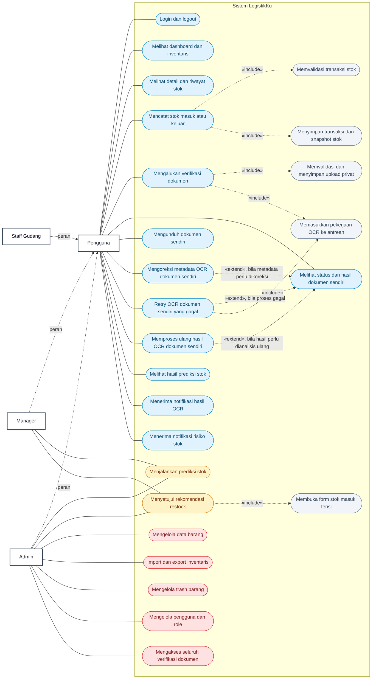
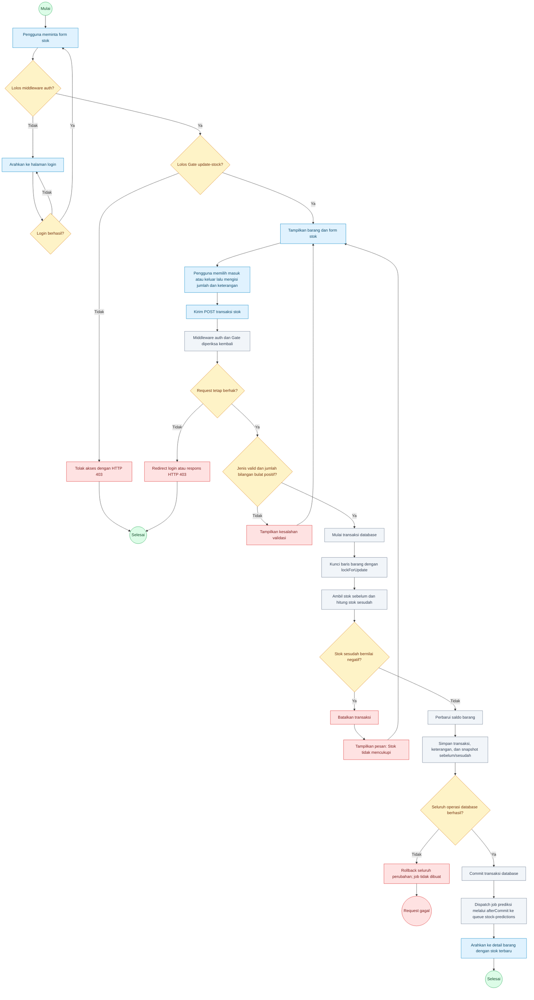
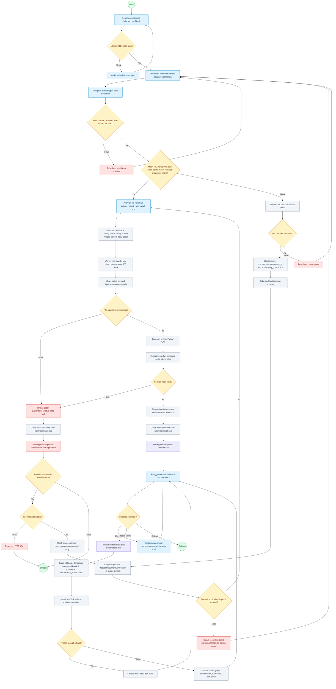

# Tugas 1.2 — Diagram Alur Proses Bisnis LogistikKu

## 1. Use Case Diagram Sistem

Diagram berikut menggambarkan hak akses aktual pada sistem. Diagram ini merupakan representasi Use Case UML menggunakan `flowchart` Mermaid: batas sistem ditunjukkan oleh subgraf, use case oleh bentuk oval, dan generalisasi aktor oleh panah putus-putus. Semua fitur aplikasi selain login berada di balik middleware `auth`. Admin memiliki akses administratif, sedangkan Manager dan Staff Gudang hanya dapat mengakses dokumen yang mereka unggah sendiri. Hasil verifikasi dokumen merupakan bantuan pemeriksaan dan bukan bukti mutlak keaslian hukum.

`«include»` digunakan untuk langkah wajib dari use case induk. `«extend»` digunakan untuk tindakan opsional yang hanya tersedia pada kondisi tertentu. Persetujuan rekomendasi restock hanya membuka form stok masuk yang telah terisi; saldo belum berubah sampai pengguna mengirim transaksi stok yang valid.

### Ringkasan hak akses

| Kelompok use case | Admin | Manager | Staff Gudang |
|---|:---:|:---:|:---:|
| Dashboard, inventaris, detail, dan riwayat | Ya | Ya | Ya |
| Stok masuk dan stok keluar | Ya | Ya | Ya |
| Upload dan pengelolaan dokumen sendiri | Ya | Ya | Ya |
| Melihat hasil prediksi tersimpan | Ya | Ya | Ya |
| Menjalankan prediksi dan menyetujui restock | Ya | Ya | Tidak |
| CRUD barang, import/export, dan trash | Ya | Tidak | Tidak |
| Mengelola pengguna dan role | Ya | Tidak | Tidak |
| Mengakses dokumen pengguna lain | Ya | Tidak | Tidak |

## 2. Activity Diagram — Alur Stok Masuk/Keluar

Aturan bisnis utama:

1. Saldo stok hanya berubah melalui transaksi stok, bukan melalui form edit barang.
2. Stok keluar tidak boleh membuat saldo negatif.
3. Perubahan saldo dan pencatatan riwayat dilakukan secara atomik dalam satu transaksi database.
4. Setiap transaksi menyimpan `stok_sebelum` dan `stok_sesudah`.
5. `StockPredictionScheduler` mendaftarkan `ProcessStockPrediction` dengan `afterCommit`; job baru dilepas ke queue `stock-predictions` setelah transaksi database berhasil di-commit. Rollback tidak meninggalkan job.
6. Transaksi stok belum menyimpan `user_id`, sehingga diagram tidak mengklaim adanya audit pelaku untuk stok.

## 3. Activity Diagram — Alur Verifikasi Dokumen

Aturan bisnis utama:

1. Jenis dokumen aktual adalah Surat Jalan (`surat_jalan`), Invoice (`invoice`), dan Bukti Fisik (`bukti_fisik`). Judul “Informasi Bukti Penerimaan” pada form metadata tidak mengubah nama jenis dokumen `bukti_fisik`.
2. File PDF, JPG, JPEG, atau PNG maksimal 10 MB disimpan pada disk `local`, yang berakar di `storage/app/private`.
3. Upload awal dan retry diproses asinkron melalui queue konfigurasi default (`default` pada konfigurasi database bawaan). Proses ulang berjalan sinkron melalui controller dan tidak dimasukkan ke queue.
4. Duplikat ditentukan oleh hash isi file, ID pengguna, dan jenis dokumen yang sama selama entri cache satu menit masih ada; record lama juga harus masih ditemukan dan dimiliki pengguna tersebut.
5. `process_status` dipisahkan dari `authenticity_status`; kegagalan teknis bukan berarti dokumen palsu.
6. Manager dan Staff Gudang hanya dapat mengakses dokumen sendiri, sedangkan Admin dapat mengakses seluruh dokumen.
7. Upload, antrean, mulai/selesai/gagal OCR, retry, proses ulang, dan koreksi metadata dicatat dalam jejak audit sesuai jalurnya. Notifikasi database dikirim secara aman setelah job upload awal/retry selesai atau gagal; kegagalan notifikasi tidak mengubah hasil OCR.
8. Hasil otomatis tetap perlu ditinjau manusia dan bukan keputusan hukum final.

## 4. Ketertelusuran ke Kebutuhan

| Diagram | Kebutuhan terkait |
|---|---|
| Use Case Diagram | FR-INV-001–008, FR-STK-001–006, FR-OCR-001–008, dan FR-ML-001–008. Manajemen pengguna/role berasal dari route resource `users` dan `UserController`; SRS Tugas 1.1 tidak memberinya ID FR tersendiri. |
| Activity Diagram Stok | FR-STK-001, FR-STK-002, FR-STK-003, FR-STK-004, FR-STK-006 |
| Activity Diagram Verifikasi Dokumen | FR-OCR-001, FR-OCR-002, FR-OCR-003, FR-OCR-004, FR-OCR-005, FR-OCR-006, FR-OCR-007, FR-OCR-008 |

## 5. Dasar Validasi

Diagram dicocokkan dengan `routes/web.php`, middleware `EnsureUserHasRole`, Gate pada `AppServiceProvider`, Form Request, controller barang/prediksi/verifikasi, `StockAdjustmentService`, `StockPredictionScheduler`, job OCR/prediksi, model dan migration terkait, engine `python/document_checker.py`, feature/unit test, serta `SRS_TUGAS_1_1.md`.

Otorisasi aktual tidak menggunakan class Policy atau Spatie Permission. Aplikasi menggunakan middleware `auth`, middleware `role:admin`, Gate `update-stock`, `run-stock-prediction`, dan `approve-restock`, otorisasi Form Request, serta pemeriksaan pemilik dokumen atau Admin di controller.
