# ERD Database LogistikKu

Dokumen ini menggambarkan **skema akhir** setelah seluruh migration di `database/migrations` dijalankan berurutan, lalu mencocokkannya dengan relasi Eloquent di `app/Models`. Fokus ERD adalah tabel bisnis yang terhubung langsung dengan `users`, `barang`, `stok_transactions`, `document_verifications`, atau `stock_predictions`.

## ERD

Keterangan atribut: `PK` = primary key, `FK` = foreign key, `UK` = unique key. Kolom tanpa keterangan `nullable` bersifat wajib (`NOT NULL`). Tipe dibuat ringkas agar valid dan terbaca di Mermaid.

```mermaid
erDiagram
    USERS {
        bigint id PK
        varchar name
        varchar email UK
        varchar role "default staff"
        timestamp email_verified_at "nullable"
        varchar password
        varchar remember_token "nullable"
        timestamp created_at "nullable"
        timestamp updated_at "nullable"
    }

    SUPPLIERS {
        bigint id PK
        varchar kode_supplier UK
        varchar nama_supplier
        varchar contact_person "nullable"
        varchar telepon "nullable"
        varchar email "nullable"
        text alamat "nullable"
        boolean is_active "default true"
        timestamp created_at "nullable"
        timestamp updated_at "nullable"
        timestamp deleted_at "nullable; soft delete"
    }

    WAREHOUSES {
        bigint id PK
        varchar kode_gudang UK
        varchar nama_gudang
        text alamat "nullable"
        text keterangan "nullable"
        boolean is_active "default true"
        timestamp created_at "nullable"
        timestamp updated_at "nullable"
        timestamp deleted_at "nullable; soft delete"
    }

    BARANG {
        bigint id PK
        bigint supplier_id FK "nullable"
        varchar kode_barang UK
        varchar nama_barang
        varchar kategori
        uint stok "default 0; CHECK >= 0"
        decimal_10_2 daily_usage_estimate "nullable"
        ushort lead_time_days "nullable"
        varchar satuan
        varchar lokasi
        varchar foto_barang "nullable"
        timestamp created_at "nullable"
        timestamp deleted_at "nullable; soft delete"
    }

    STOK_TRANSACTIONS {
        bigint id PK
        bigint barang_id FK "wajib; delete RESTRICT"
        bigint supplier_id FK "nullable"
        bigint warehouse_stock_id FK "nullable; delete RESTRICT"
        enum jenis "masuk atau keluar"
        int jumlah "CHECK > 0"
        uint stok_sebelum "nullable; berpasangan"
        uint stok_sesudah "nullable; berpasangan"
        text keterangan "nullable"
        timestamp created_at "nullable"
        timestamp updated_at "nullable"
    }

    WAREHOUSE_STOCKS {
        bigint id PK
        bigint barang_id FK "composite UK"
        bigint warehouse_id FK "composite UK"
        uint stok "default 0"
        uint stok_minimum "default 0"
        timestamp created_at "nullable"
        timestamp updated_at "nullable"
    }

    STOK_HISTORIES {
        bigint id PK
        bigint barang_id FK
        enum jenis "masuk atau keluar"
        int jumlah
        varchar keterangan "nullable"
        timestamp created_at "nullable"
        timestamp updated_at "nullable"
    }

    DOCUMENT_VERIFICATIONS {
        bigint id PK
        bigint user_id FK
        bigint ocr_corrected_by FK "nullable"
        varchar_30 document_type
        varchar original_filename
        varchar file_path
        varchar_20 process_status "default menunggu"
        varchar_20 authenticity_status "nullable"
        tinyint readability_score "default 0"
        tinyint completeness_score "default 0"
        tinyint authenticity_score "default 50"
        tinyint overall_score "default 0"
        varchar document_number "nullable"
        date document_date "nullable"
        varchar purchase_order_number "nullable"
        varchar do_number "nullable"
        varchar sender "nullable"
        varchar recipient "nullable"
        varchar_30 vehicle_number "nullable"
        uint total_items "nullable"
        longtext ocr_raw_text "nullable"
        timestamp ocr_corrected_at "nullable"
        text message
        longtext_json analysis_details "MariaDB JSON alias"
        longtext_json extracted_metadata "nullable; MariaDB JSON alias"
        text error_message "nullable"
        timestamp created_at "nullable"
        timestamp updated_at "nullable"
    }

    DOCUMENT_VERIFICATION_AUDITS {
        bigint id PK
        bigint document_verification_id FK
        bigint user_id FK "nullable"
        varchar_60 event
        varchar_20 source
        longtext_json before_values "nullable; MariaDB JSON alias"
        longtext_json after_values "nullable; MariaDB JSON alias"
        longtext_json changed_fields "nullable; MariaDB JSON alias"
        longtext_json confidence "nullable; MariaDB JSON alias"
        longtext_json extraction_status "nullable; MariaDB JSON alias"
        longtext_json technical_metadata "nullable; MariaDB JSON alias"
        varchar_191 idempotency_key UK
        timestamp created_at "default current"
    }

    NOTIFICATIONS {
        char_36 id PK "UUID"
        varchar type
        varchar notifiable_type "polymorphic"
        bigint notifiable_id "polymorphic"
        text data "JSON payload by Laravel cast"
        timestamp read_at "nullable"
        timestamp created_at "nullable"
        timestamp updated_at "nullable"
    }

    STOCK_PREDICTIONS {
        bigint id PK
        bigint barang_id FK
        bigint analyzed_by FK "nullable"
        bigint process_generation "nullable; composite UK"
        uint current_stock
        decimal_12_2 predicted_30_day_need "nullable"
        date predicted_minimum_date "nullable"
        date predicted_depletion_date "nullable"
        uint safety_stock "nullable"
        uint recommended_restock "default 0"
        varchar_30 status
        varchar_30 method "nullable"
        varchar_40 analysis_status "default completed"
        longtext_json metrics "nullable; MariaDB JSON alias"
        longtext_json input_summary "nullable; MariaDB JSON alias"
        timestamp analyzed_at "default dan ON UPDATE current di DB aktual"
        timestamp created_at "nullable"
        timestamp updated_at "nullable"
    }

    STOCK_PREDICTION_NOTIFICATIONS {
        bigint id PK
        bigint stock_prediction_id FK "composite UK"
        bigint barang_id FK "composite UK"
        varchar_30 status "composite UK"
        timestamp read_at "nullable; legacy/global"
        timestamp created_at "nullable"
        timestamp updated_at "nullable"
    }

    STOCK_PREDICTION_NOTIFICATION_READS {
        bigint id PK
        bigint stock_prediction_notification_id FK
        bigint user_id FK
        timestamp read_at "nullable"
        timestamp created_at "nullable"
        timestamp updated_at "nullable"
    }

    STOCK_PREDICTION_PROCESSES {
        bigint id PK
        bigint barang_id FK,UK
        bigint requested_by FK "nullable"
        varchar_20 status "default waiting"
        bigint generation "default 1"
        bigint source_transaction_id "nullable; bukan FK"
        bigint stock_prediction_id FK "nullable"
        varchar_255 error_message "nullable"
        timestamp started_at "nullable"
        timestamp completed_at "nullable"
        timestamp created_at "nullable"
        timestamp updated_at "nullable"
    }

    USERS ||--o{ DOCUMENT_VERIFICATIONS : "mengunggah (user_id)"
    USERS o|--o{ DOCUMENT_VERIFICATIONS : "mengoreksi OCR (ocr_corrected_by)"
    DOCUMENT_VERIFICATIONS ||--o{ DOCUMENT_VERIFICATION_AUDITS : "memiliki audit"
    USERS o|--o{ DOCUMENT_VERIFICATION_AUDITS : "menjadi aktor"
    USERS o|--o{ NOTIFICATIONS : "menerima; polymorphic tanpa FK"

    BARANG ||--o{ STOK_TRANSACTIONS : "memiliki transaksi legacy"
    SUPPLIERS o|--o{ BARANG : "menjadi supplier utama"
    SUPPLIERS o|--o{ STOK_TRANSACTIONS : "menjadi supplier asal"
    BARANG ||--o{ WAREHOUSE_STOCKS : "memiliki saldo gudang"
    WAREHOUSES ||--o{ WAREHOUSE_STOCKS : "menyimpan saldo"
    WAREHOUSE_STOCKS o|--o{ STOK_TRANSACTIONS : "menjadi asal saldo"
    BARANG ||--o{ STOK_HISTORIES : "memiliki histori"
    BARANG ||--o{ STOCK_PREDICTIONS : "diprediksi"
    USERS o|--o{ STOCK_PREDICTIONS : "menganalisis"
    STOCK_PREDICTIONS ||--o{ STOCK_PREDICTION_NOTIFICATIONS : "menghasilkan"
    BARANG ||--o{ STOCK_PREDICTION_NOTIFICATIONS : "menjadi subjek"
    STOCK_PREDICTION_NOTIFICATIONS ||--o{ STOCK_PREDICTION_NOTIFICATION_READS : "memiliki status baca"
    USERS ||--o{ STOCK_PREDICTION_NOTIFICATION_READS : "menerima"
    BARANG ||--o| STOCK_PREDICTION_PROCESSES : "memiliki proses aktif"
    USERS o|--o{ STOCK_PREDICTION_PROCESSES : "meminta proses"
    STOCK_PREDICTIONS o|--o{ STOCK_PREDICTION_PROCESSES : "hasil proses menurut DB"
```

Catatan kardinalitas: relasi yang memakai `o|` pada sisi induk berarti FK pada anak nullable (nol atau satu induk). `barang_id` pada `stock_prediction_processes` unik, sehingga satu barang hanya dapat memiliki nol atau satu baris proses. Sebaliknya, `stock_prediction_id` pada tabel tersebut **tidak unik**; database mengizinkan satu prediksi dirujuk banyak proses walaupun model `StockPrediction::process()` mendeklarasikan `hasOne`.

Tidak dibuat garis dari `STOK_TRANSACTIONS` ke `STOCK_PREDICTION_PROCESSES`: `source_transaction_id` memang menyerupai referensi transaksi, tetapi migration tidak membuat FK dan model tidak mendeklarasikan relasi. Demikian pula ID verifikasi di `notifications.data` hanya berada dalam payload, bukan kolom/FK relasional.

## Fungsi tabel dan alur bisnis

| Tabel | Fungsi |
|---|---|
| `users` | Akun pengguna, peran aplikasi, pemilik dokumen, analis/peminta prediksi, aktor audit, dan penerima notifikasi. |
| `suppliers` | Master supplier aktif/nonaktif; dapat menjadi supplier utama barang dan supplier asal transaksi stok. Soft delete aktif. |
| `warehouses` | Master gudang aktif/nonaktif. `GDG-UTAMA` adalah gudang default yang dibuat migration secara idempotent. Soft delete aktif. |
| `warehouse_stocks` | Saldo dan stok minimum satu barang pada satu gudang; pasangan barang/gudang unik. |
| `barang` | Master barang dan stok terkini; menyimpan input estimasi konsumsi serta lead time. Soft delete aktif. |
| `stok_transactions` | Ledger mutasi stok masuk/keluar beserta snapshot sebelum dan sesudah. |
| `stok_histories` | Histori stok lama/alternatif yang juga terhubung ke barang; masih memiliki model dan FK aktual. |
| `document_verifications` | Dokumen yang diproses OCR, metadata hasil ekstraksi, skor, status proses, dan hasil keaslian. |
| `document_verification_audits` | Jejak append-only perubahan/proses verifikasi dengan kunci idempotensi unik. |
| `notifications` | Notifikasi database polymorphic Laravel yang secara aktual dipakai untuk hasil verifikasi dokumen. |
| `stock_predictions` | Snapshot hasil analisis kebutuhan/restock suatu barang pada waktu tertentu. |
| `stock_prediction_notifications` | Notifikasi bisnis yang dihasilkan dari prediksi untuk barang/status tertentu. |
| `stock_prediction_notification_reads` | Status baca notifikasi prediksi per pengguna. |
| `stock_prediction_processes` | Satu state proses prediksi aktif per barang, termasuk generasi, peminta, hasil, dan informasi kegagalan. |

Alur stok: `suppliers` dapat direferensikan secara opsional sebagai supplier utama `barang` dan supplier asal `stok_transactions`. Setiap kombinasi barang/gudang memiliki satu `warehouse_stocks`; `barang.stok` tetap menjadi total/legacy. Migration membuat `GDG-UTAMA`, menyalin setiap stok barang lama tepat sekali ke gudang tersebut, lalu menghubungkan transaksi lama melalui `warehouse_stock_id`. Workflow stok lama memperbarui total barang dan saldo gudang utama dalam transaksi database yang sama. Snapshot transaksi tetap menggambarkan total legacy agar kompatibel dengan implementasi lama. Data barang dan riwayat transaksi menjadi masukan prediksi. Setiap hasil disimpan di `stock_predictions`, dapat menghasilkan notifikasi, lalu setiap pengguna memperoleh status baca sendiri.

Alur dokumen: pengguna mengunggah `document_verifications`. Pengguna lain atau pengguna yang sama dapat menjadi korektor OCR melalui `ocr_corrected_by`. Semua kejadian penting dicatat di `document_verification_audits`; selesai/gagalnya proses dikirim melalui `notifications` kepada pemilik dokumen. Hubungan notifikasi ke dokumen disimpan dalam payload `data`, bukan FK.

## Aturan FK dan integritas

- `CASCADE DELETE`: barang ke `stok_histories`, `stock_predictions`, `stock_prediction_notifications`, dan `stock_prediction_processes`; prediksi ke notifikasi prediksi; notifikasi prediksi ke status baca; pengguna ke status baca; verifikasi ke audit; pengguna pengunggah ke verifikasi.
- `SET NULL`: `document_verifications.ocr_corrected_by`, `document_verification_audits.user_id`, `stock_predictions.analyzed_by`, `stock_prediction_processes.requested_by`, dan `stock_prediction_processes.stock_prediction_id` ketika induknya dihapus.
- `SET NULL` juga berlaku dari `suppliers` ke `barang.supplier_id` dan `stok_transactions.supplier_id`. Soft delete supplier tidak memicu FK; force delete mempertahankan kedua record anak dan mengosongkan referensinya.
- `RESTRICT DELETE/UPDATE` melindungi rantai histori utama: `stok_transactions.barang_id`, `stok_transactions.warehouse_stock_id`, `warehouse_stocks.barang_id`, dan `warehouse_stocks.warehouse_id`. Barang, gudang, atau saldo yang masih dipakai tidak dapat dihapus permanen. `stok_transactions.barang_id` wajib terisi (`NOT NULL`).
- `BarangTrashController` menolak force delete sebelum menyentuh file/data bila barang masih memiliki transaksi, saldo gudang, histori stok legacy, prediksi, notifikasi prediksi, atau proses prediksi. Soft delete tetap menjadi jalur penghapusan normal dan tidak memengaruhi histori.
- Seluruh **20 FK aktual** memakai `ON UPDATE RESTRICT`; tidak ada FK dengan cascade atau set-null saat key induk diperbarui.
- `notifications.notifiable_type/notifiable_id` adalah pasangan polymorphic berindeks, tetapi tidak mempunyai FK database.
- `stock_prediction_processes.source_transaction_id` tidak mempunyai FK. Penghapusan transaksi tidak dijaga database terhadap nilai ini.
- Check constraint stok memastikan `barang.stok >= 0`, jumlah transaksi positif, pasangan snapshot sama-sama null atau sama-sama terisi, snapshot nonnegatif, dan persamaan stok sesuai jenis mutasi.
- Unique aktual: `users.email`, `suppliers.kode_supplier`, `warehouses.kode_gudang`, pasangan (`warehouse_stocks.barang_id`, `warehouse_stocks.warehouse_id`), `barang.kode_barang`, `document_verification_audits.idempotency_key`, pasangan (`barang_id`, `process_generation`) pada prediksi, tripel (`stock_prediction_id`, `barang_id`, `status`) pada notifikasi prediksi, serta `stock_prediction_processes.barang_id`. Migration mendeklarasikan unique pasangan (`stock_prediction_notification_id`, `user_id`) pada status baca, tetapi constraint itu **tidak ada di database aktual**.
- `warehouse_stocks.stok` dan `stok_minimum` nonnegatif: MySQL/MariaDB menegakkannya melalui tipe unsigned, sedangkan jalur SQLite migration memakai check constraint eksplisit.
- Nilai status dokumen divalidasi oleh event model, bukan check constraint database: proses `menunggu/diproses/selesai/gagal`; hasil keaslian hanya boleh terisi ketika selesai dan bernilai `asli/mencurigakan/palsu`.

## Audit migration versus model

Yang selaras:

- `Barang` menetapkan tabel nonstandar `barang`, memakai `SoftDeletes`, dan mematikan `UPDATED_AT`, sesuai kolom migration yang tidak memiliki `updated_at`.
- `DocumentVerification` sudah memakai `process_status` dan `authenticity_status`; kolom lama `status` telah dihapus oleh migration terakhir.
- Cast array/JSON, tanggal, datetime, dan decimal pada model-model bisnis sesuai tipe kolom migration.
- Semua `belongsTo` yang dideklarasikan pada model mempunyai kolom dan FK yang sesuai.

Ketidaksesuaian atau relasi yang hanya tersedia di satu lapisan:

- `StokHistory::barang()` ada, tetapi `Barang` tidak memiliki inverse `stokHistories()`.
- Sejumlah FK mempunyai relasi database tetapi tidak mempunyai method Eloquent pada sisi terkait: aktor audit pada `User`, korektor OCR pada `User`, analis prediksi pada `User`, penerima notifikasi prediksi pada `User`, dan peminta proses prediksi pada kedua model terkait.
- `StockPrediction::process()` adalah `hasOne`, tetapi `stock_prediction_processes.stock_prediction_id` tidak unik. Database memungkinkan banyak baris proses merujuk prediksi yang sama.
- `StockPredictionProcess` tidak memiliki relasi balik ke `StockPrediction` untuk FK `stock_prediction_id` dan tidak memiliki relasi peminta untuk FK `requested_by`.
- `source_transaction_id` dicast sebagai integer pada `StockPredictionProcess`, tetapi tidak mempunyai FK ke `stok_transactions` maupun relasi Eloquent. Karena itu ERD menampilkannya sebagai atribut biasa.
- `User` memperoleh relasi `notifications()` dari trait Laravel `Notifiable`; tabel memakai relasi polymorphic tanpa FK. Referensi ke verifikasi dokumen berada dalam `data`, sehingga integritasnya tidak dijamin database.
- `stock_prediction_notifications.read_at` masih ada sebagai status baca lama/global, sementara implementasi kini juga memiliki status baca per pengguna pada `stock_prediction_notification_reads`.
- Relasi multi-gudang tersedia pada kedua lapisan: `Barang` dan `Warehouse` menuju saldo/transaksi, `WarehouseStock` menuju induk/transaksi, serta `Supplier` menuju saldo melalui `Barang`. Relasi langsung lama `Barang::stokTransactions()` tetap dipertahankan bersama relasi through baru `Barang::warehouseStokTransactions()`.
- Migration koreksi `2026_09_16_030000_enforce_stock_history_item_integrity` menggantikan aturan nullable/`SET NULL` sementara dari migration Multi-Gudang tanpa mengedit migration yang telah dijalankan. `down()` mengembalikan kontrak migration sebelumnya tanpa menghapus baris.
- Migration pembuatan `stock_prediction_notification_reads` mendeklarasikan `prediction_notification_user_unique` untuk pasangan notifikasi/pengguna, tetapi `information_schema` dan `SHOW CREATE TABLE` membuktikan bahwa database aktual hanya memiliki dua index FK non-unique. Database saat ini dapat menerima duplikasi pasangan tersebut; anotasi `UK` karena itu dihapus dari ERD aktual.
- Pada MariaDB 10.4.32 aktual, `stock_predictions.analyzed_at` memiliki `DEFAULT current_timestamp()` dan `ON UPDATE current_timestamp()` walaupun migration hanya mendeklarasikan `timestamp('analyzed_at')`. Model memperlakukannya sebagai datetime biasa. Ini adalah perbedaan perilaku fisik yang dipengaruhi konfigurasi/semantik `TIMESTAMP` MariaDB.
- Kolom yang dideklarasikan `json` oleh migration tersimpan secara fisik sebagai `LONGTEXT` dengan `CHECK (json_valid(...))` pada MariaDB. ERD memakai tipe `longtext_json` untuk mencerminkan keduanya.
- `stok_histories` dan `stok_transactions` sama-sama merekam mutasi stok, tetapi hanya `stok_transactions` yang memiliki snapshot dan check constraint integritas. Keduanya tetap didokumentasikan karena keduanya memiliki model dan FK aktual ke `barang`.

## Inventaris seluruh tabel migration

| Tabel | Keputusan | Alasan |
|---|---|---|
| `users` | Masuk ERD | Tabel utama dan induk banyak relasi bisnis. |
| `suppliers` | Masuk ERD | Master supplier dan induk langsung barang/transaksi stok. |
| `warehouses` | Masuk ERD | Master gudang dan induk saldo per gudang. |
| `warehouse_stocks` | Masuk ERD | Penghubung langsung barang, gudang, dan transaksi stok. |
| `password_reset_tokens` | Tidak masuk | Infrastruktur autentikasi; tidak ada FK/relasi bisnis. |
| `sessions` | Tidak masuk | Infrastruktur sesi. `user_id` hanya nullable dan berindeks, bukan FK. |
| `cache` | Tidak masuk | Infrastruktur cache. |
| `cache_locks` | Tidak masuk | Infrastruktur lock cache. |
| `jobs` | Tidak masuk | Infrastruktur antrean; payload tidak membentuk relasi database. |
| `job_batches` | Tidak masuk | Infrastruktur batch antrean. |
| `failed_jobs` | Tidak masuk | Infrastruktur kegagalan antrean. |
| `barang` | Masuk ERD | Tabel utama persediaan. |
| `stok_histories` | Masuk ERD | Relasi bisnis langsung ke `barang`; mempunyai model aktual. |
| `stok_transactions` | Masuk ERD | Tabel utama ledger stok. |
| `document_verifications` | Masuk ERD | Tabel utama verifikasi dokumen. |
| `stock_predictions` | Masuk ERD | Tabel utama prediksi stok. |
| `stock_prediction_notifications` | Masuk ERD | Turunan langsung prediksi dan barang. |
| `notifications` | Masuk ERD | Walau merupakan tabel Laravel, dipakai langsung oleh alur notifikasi hasil verifikasi dokumen. |
| `document_verification_audits` | Masuk ERD | Audit langsung verifikasi dokumen dan aktor pengguna. |
| `stock_prediction_notification_reads` | Masuk ERD | Penghubung langsung notifikasi prediksi dengan pengguna. |
| `stock_prediction_processes` | Masuk ERD | State proses langsung untuk barang, pengguna, dan hasil prediksi. |
| `migrations` | Tidak masuk | Tabel internal Laravel untuk status migration; dibuat oleh migrator, bukan `Schema::create` project. |

Source migration mendefinisikan **21 tabel**. Database aktual berisi **22 tabel** setelah menyertakan tabel internal `migrations`: 14 dimasukkan ke ERD dan 8 dikecualikan.

## Validasi

- Audit statis mencakup seluruh **26 file migration** dan **13 model** di repository.
- Koneksi ke schema MySQL/MariaDB `db_logistik` berhasil. Server aktual adalah MariaDB 10.4.32 dan seluruh 26 migration berstatus `Ran`.
- Audit `information_schema` menemukan 22 tabel dan 20 FK, serta aturan PK/unique/nullability/delete/update yang dijelaskan di atas.
- Backfill aktual tervalidasi: 1 gudang utama, 100 saldo untuk 100 barang, tidak ada barang terlewat, total `warehouse_stocks.stok` 5.200 sama dengan total `barang.stok`, dan seluruh 375 transaksi lama terhubung ke saldo gudang utama.
- Audit koreksi histori tervalidasi: 375 transaksi, tidak ada `barang_id` null/orphan, kolom aktual `BIGINT UNSIGNED NOT NULL`, dan keempat FK pelindung histori memakai `ON DELETE RESTRICT ON UPDATE RESTRICT`.
- Skema akhir memperhitungkan migration lanjutan: penambahan soft delete/foto/input prediksi/snapshot stok/nomor DO, pemisahan skor, serta penggantian `document_verifications.status` menjadi dua kolom status.
- Setiap garis relasi ber-FK pada ERD dicocokkan dengan deklarasi `foreignId()->constrained()` atau `foreign()->references()`; relasi polymorphic tanpa FK diberi label eksplisit.
- Kardinalitas nullable dan unique dicocokkan dengan migration, bukan diasumsikan dari nama kolom.
- Pemeriksaan struktural sintaks Mermaid lulus: satu blok `erDiagram`, seluruh entitas/atribut memiliki kurung seimbang, tipe atribut berbentuk satu token, dan semua relasi memakai notasi crow's-foot yang valid. CLI/parser Mermaid tidak tersedia di dependensi lokal, sehingga tidak dilakukan render otomatis.
- Perbandingan database dengan source menemukan dua drift fisik: unique pasangan status-baca yang hilang dan perilaku implicit default/auto-update pada `stock_predictions.analyzed_at`. Representasi fisik JSON sebagai `LONGTEXT + json_valid` adalah pemetaan normal MariaDB, bukan kolom bisnis yang hilang.
