# Software Requirements Specification (SRS)

## Sistem Inventaris LogistikKu

| Informasi dokumen | Nilai |
|---|---|
| ID dokumen | SRS-LOGISTIKKU-1.1 |
| Versi | 1.1 |
| Status | Final — audit Tugas 1.1–1.3 |
| Tanggal publikasi | 15 September 2026 |
| Jenis sistem | Aplikasi web pengelolaan persediaan |
| Dasar dokumen | Implementasi repository, SRS Tugas 1.1, dan diagram Tugas 1.2 |
| Ruang lingkup | Inventaris, transaksi dan riwayat stok, import/export, verifikasi dokumen OCR, prediksi restock, notifikasi, dan administrasi pengguna |
| Validasi baseline | PHPUnit: 236 test/2.817 assertion; Python: 55 test; seluruhnya lulus pada audit 15 September 2026 |

Dokumen ini merupakan spesifikasi *as-built*: pernyataan **Sudah Tersedia** hanya diberikan kepada fungsi yang ditemukan dalam implementasi dan didukung bukti yang relevan. Target yang masih bergantung pada lingkungan deployment tidak dinyatakan telah terpenuhi di produksi.

### Daftar isi

1. [Informasi dan riwayat dokumen](#informasi-dokumen)
2. [Pendahuluan](#pendahuluan)
3. [Gambaran umum sistem](#gambaran-umum)
4. [Kebutuhan fungsional](#kebutuhan-fungsional)
5. [Kebutuhan nonfungsional](#kebutuhan-nonfungsional)
6. [Hak akses pengguna](#hak-akses)
7. [Aturan bisnis](#aturan-bisnis)
8. [Antarmuka dan dependensi](#antarmuka-dependensi)
9. [Batasan, asumsi, deployment, dan keamanan](#batasan-asumsi)
10. [Referensi diagram proses bisnis](#referensi-diagram)
11. [Kriteria penerimaan](#kriteria-penerimaan)
12. [Matriks ketertelusuran](#matriks-ketertelusuran)
13. [Bagian yang masih perlu dipastikan](#perlu-dipastikan)

---

## 1. Informasi dan Riwayat Dokumen

### 1.1 Riwayat revisi

| Versi | Tanggal | Perubahan | Status |
|---|---|---|---|
| 0.1 | 14 September 2026 | Pemetaan kebutuhan, persona, hak akses, aturan bisnis, NFR, dan bukti pengujian pada Tugas 1.1 | Dokumen sumber |
| 0.2 | 15 September 2026 | Finalisasi Use Case Diagram dan Activity Diagram stok serta verifikasi dokumen pada Tugas 1.2 | Dokumen sumber |
| 1.0 | 15 September 2026 | Konsolidasi menjadi SRS resmi yang konsisten dengan implementasi aktual | Baseline publikasi |
| 1.1 | 15 September 2026 | Audit final persona, kebutuhan file, ketertelusuran, dan penyematan hasil render tiga diagram | Final audit |

### 1.2 Definisi status pemenuhan

| Status | Arti |
|---|---|
| **Sudah Tersedia** | Implementasi dan bukti pengujian yang relevan ditemukan. |
| **Tersedia Sebagian** | Sebagian kebutuhan tersedia, tetapi cakupan tertentu belum diterapkan atau belum terbukti. |
| **Perlu Konfirmasi** | Keputusan bisnis, lingkungan, atau bukti yang diperlukan belum tersedia. |
| **Perlu Uji Produksi** | Validasi lokal tersedia, tetapi hasil pada stack produksi belum dibuktikan. |

### 1.3 Sumber normatif

Dokumen ini disusun dari:

- `docs/SRS_TUGAS_1_1.md`;
- `docs/TUGAS_1_2_DIAGRAM_ALUR_PROSES_BISNIS.md`;
- route, middleware, Gate, Form Request, controller, service, model, migration, konfigurasi, job/queue, engine Python, view, dan test dalam repository LogistikKu.

Apabila terdapat perbedaan antara uraian dan perilaku aktual, kode serta pengujian pada baseline repository menjadi bukti keadaan sistem saat ini. Perubahan kebutuhan setelah baseline harus dicatat sebagai revisi dokumen dan tidak dianggap telah tersedia sebelum diimplementasikan serta diuji.

---

## 2. Pendahuluan

### 2.1 Tujuan

SRS ini mendefinisikan perilaku, batas, kualitas, hak akses, dan kriteria penerimaan Sistem Inventaris LogistikKu. Dokumen ditujukan sebagai acuan bersama bagi pemilik proses, pengguna, pengembang, penguji, dan operator deployment.

### 2.2 Ruang lingkup

LogistikKu menyediakan:

- pengelolaan data master barang dan foto;
- pencarian, filter, pengurutan, dashboard, serta riwayat stok;
- transaksi stok masuk dan keluar secara atomik;
- import inventaris serta export CSV, XLSX, dan PDF;
- verifikasi Surat Jalan, Invoice, dan Bukti Fisik dengan OCR;
- koreksi metadata, audit, retry, proses ulang, dan notifikasi OCR;
- prediksi restock berbasis histori dan input operasional;
- pengelolaan akun dengan role tetap `admin`, `manager`, dan `staff`.

Di luar ruang lingkup baseline:

- permission granular di luar tiga role tetap;
- perubahan stok otomatis dari rekomendasi prediksi;
- keputusan hukum final mengenai keaslian dokumen;
- health monitoring worker yang terintegrasi;
- jaminan performa produksi sebelum pengujian pada lingkungan target.

### 2.3 Istilah dan singkatan

| Istilah | Definisi |
|---|---|
| Barang aktif | Barang yang tidak berstatus *soft-deleted*. |
| Stok masuk/keluar | Transaksi yang menambah/mengurangi saldo barang dan menghasilkan riwayat. |
| Snapshot stok | Nilai `stok_sebelum` dan `stok_sesudah` pada transaksi. |
| OCR | *Optical Character Recognition*, proses ekstraksi teks dan metadata dokumen. |
| ELA | *Error Level Analysis*, salah satu indikator analisis citra; bukan bukti hukum. |
| Bukti Fisik | Jenis dokumen aktual bernilai `bukti_fisik`; tampilan metadata menggunakan judul “Informasi Bukti Penerimaan”. |
| `process_status` | Status proses OCR: `menunggu`, `diproses`, `selesai`, atau `gagal`. |
| `authenticity_status` | Hasil OCR: `asli`, `mencurigakan`, atau `palsu`; hanya boleh terisi ketika proses `selesai`. |
| Retry OCR | Memasukkan kembali proses yang gagal ke queue secara asinkron. |
| Proses ulang OCR | Menjalankan OCR ulang secara sinkron melalui controller dengan pilihan mempertahankan atau mengganti koreksi manual. |
| `afterCommit` | Mekanisme yang memastikan job prediksi baru dilepas ke queue setelah transaksi database berhasil di-commit. |
| Cold-start | Prediksi ketika histori belum tersedia dan sistem memakai estimasi awal yang memenuhi syarat. |
| Confidence | Tingkat keyakinan perhitungan; bukan kepastian hasil. |

---

## 3. Gambaran Umum Sistem

### 3.1 Perspektif sistem

LogistikKu adalah aplikasi Laravel berbasis web. Browser berinteraksi dengan route web dan Blade; middleware, Gate, Form Request, serta controller menegakkan akses dan validasi. Service menangani aturan bisnis dan transaksi database. Pekerjaan panjang dijalankan oleh job queue dan engine Python, kecuali proses ulang OCR yang masih sinkron.

| Lapisan | Tanggung jawab utama |
|---|---|
| Antarmuka web | Form, daftar, dashboard, grafik, hasil OCR, status proses, dan notifikasi. |
| Laravel | Autentikasi, otorisasi, validasi, orkestrasi proses, dan respons HTTP. |
| Service/job | Integritas stok, import, laporan, audit OCR, notifikasi, prediksi, serta pemanggilan Python. |
| Database | Data pengguna, barang, transaksi, verifikasi, audit, prediksi, notifikasi, session/cache, dan queue database. |
| Storage | Foto barang pada disk publik dan dokumen OCR pada disk privat. |
| Python | OCR/analisis dokumen dan kalkulasi prediksi stok. |

### 3.2 Persona dan aktor

| Aktor | Tujuan | Tanggung jawab/kebutuhan utama | Batasan utama |
|---|---|---|---|
| Admin | Menjaga data master, akun, dan proses inventaris valid serta dapat diawasi. | Mengelola barang/pengguna, import/export, trash, transaksi, prediksi, seluruh verifikasi, laporan, dan jejak audit OCR. | Saldo tetap harus berubah melalui transaksi; tidak tersedia permission granular; Admin tidak dapat menghapus akunnya sendiri melalui fitur pengguna. |
| Manager | Memantau ketersediaan dan memakai prediksi untuk keputusan restock. | Meninjau inventaris/riwayat, mencatat stok, menjalankan prediksi, menilai rekomendasi, serta mengelola dokumen sendiri. | Tidak dapat CRUD barang, import/export, trash, mengelola pengguna, atau mengakses dokumen pengguna lain; persetujuan restock tidak mengubah stok langsung. |
| Staff Gudang (`staff`) | Mencatat pergerakan stok dan memeriksa dokumen operasional miliknya. | Mencari barang, mencatat stok masuk/keluar, meninjau riwayat/prediksi tersimpan, serta mengunggah dan mengelola dokumen sendiri. | Tidak dapat menjalankan prediksi, menyetujui restock, CRUD barang, import/export, trash, mengelola pengguna, atau mengakses dokumen pengguna lain. |
| Sistem/worker | Menyelesaikan proses background secara konsisten. | Menjaga status, memanggil Python, menyimpan hasil, menerapkan retry/fallback, dan mengirim notifikasi. | Bergantung pada database, storage, queue, Python, dan Tesseract yang tersedia. |
| Operator deployment | Menyediakan lingkungan operasi yang sehat. | Menyiapkan database, storage, worker, runtime Python/Tesseract, konfigurasi, log, dan monitoring. | Health monitoring worker belum menjadi fitur baseline aplikasi. |

### 3.3 Kontrol akses aktual

Sistem tidak memakai class Policy atau Spatie Permission. Otorisasi aktual memakai middleware `auth`, middleware `role:admin`, Gate `update-stock`, `run-stock-prediction`, dan `approve-restock`, otorisasi pada Form Request, serta pemeriksaan kepemilikan dokumen di controller.

---

## 4. Kebutuhan Fungsional

Seluruh ID FR pada bagian ini unik dan mempertahankan penomoran Tugas 1.1 serta Tugas 1.2.

### 4.1 Inventaris

| ID | Kebutuhan | Kriteria penerimaan ringkas | Status |
|---|---|---|---|
| **FR-INV-001** | Sistem harus menampilkan barang aktif dan mencari berdasarkan kode, nama, atau lokasi. | Hasil benar, dipaginasi lima baris, parameter tetap terbawa, dan barang terhapus tidak muncul. | Sudah Tersedia |
| **FR-INV-002** | Sistem harus memfilter kategori/status `menipis` atau `aman` dan mengurutkan nama/stok memakai nilai yang diizinkan. | Kombinasi filter/sort valid menghasilkan data benar; nilai di luar whitelist ditolak. | Sudah Tersedia |
| **FR-INV-003** | Sistem harus menampilkan detail, dashboard, aktivitas 7/30 hari, dan pusat perhatian sesuai role. | Ringkasan berasal dari data aktif, periode selain 7/30 ditolak, dan membuka dashboard tidak menjalankan prediksi. | Sudah Tersedia |
| **FR-INV-004** | Admin harus dapat menambah barang dengan kode otomatis unik `BRG-######`. | Barang dimulai dari stok database 0; stok awal positif diterapkan melalui transaksi dengan snapshot 0 ke saldo awal. | Sudah Tersedia |
| **FR-INV-005** | Admin harus dapat mengubah data master tanpa mengubah kode atau stok melalui form edit. | Nama, kategori, estimasi, lead time, satuan, lokasi, dan foto dapat diperbarui; input `stok` tidak mengubah saldo. | Sudah Tersedia |
| **FR-INV-006** | Admin harus dapat melakukan soft delete, restore, hapus permanen, dan aksi massal pada trash. | Data berpindah/pulih sesuai aksi; role lain menerima `403`; hapus permanen membersihkan relasi dan foto terkait. | Sudah Tersedia |
| **FR-INV-007** | Admin harus dapat mengimpor XLSX, XLS, atau CSV dan melakukan upsert berdasarkan kode. | Seluruh baris divalidasi sebelum commit; kegagalan membatalkan batch; stok target diterapkan melalui transaksi. | Sudah Tersedia |
| **FR-INV-008** | Admin harus dapat mengekspor seluruh barang aktif ke XLSX, CSV, atau PDF. | Nama file, `Content-Type`, dan isi laporan sesuai format. | Sudah Tersedia |

### 4.2 Transaksi dan riwayat stok

| ID | Kebutuhan | Kriteria penerimaan ringkas | Status |
|---|---|---|---|
| **FR-STK-001** | Semua role harus dapat mencatat jenis `masuk`/`keluar`, jumlah bilangan bulat positif, dan keterangan opsional. | Saldo berubah sebesar jumlah yang benar dan tepat satu transaksi tercatat. | Sudah Tersedia |
| **FR-STK-002** | Sistem harus menolak stok keluar yang melebihi saldo. | Pesan “Stok tidak mencukupi” muncul; saldo dan riwayat tidak berubah. | Sudah Tersedia |
| **FR-STK-003** | Sistem harus menjalankan perubahan saldo dan riwayat dalam database transaction dengan `lockForUpdate()`. | Kegagalan menyebabkan rollback dan transaksi bersamaan pada barang yang sama tidak menimbulkan *lost update*. | Sudah Tersedia |
| **FR-STK-004** | Sistem harus menyimpan barang, jenis, jumlah, keterangan, waktu, `stok_sebelum`, dan `stok_sesudah`. | Constraint menerima snapshot valid dan menolak jumlah/snapshot negatif, tidak berpasangan, atau tidak sesuai rumus. | Sudah Tersedia |
| **FR-STK-005** | Sistem harus menampilkan riwayat 20 baris per halaman dan grafik maksimal 100 transaksi. | Data hanya milik barang terkait, terurut konsisten, mengabaikan transaksi masa depan, dan tidak merekonstruksi snapshot legacy yang null. | Sudah Tersedia |
| **FR-STK-006** | Sistem harus menjadwalkan prediksi setelah transaksi stok berhasil di-commit. | `ProcessStockPrediction` memakai `afterCommit`; rollback tidak membuat job dan kegagalan prediksi tidak membatalkan stok yang sah. | Sudah Tersedia |

### 4.3 Verifikasi dokumen OCR

| ID | Kebutuhan | Kriteria penerimaan ringkas | Status |
|---|---|---|---|
| **FR-OCR-001** | Semua role harus dapat mengunggah Surat Jalan, Invoice, atau Bukti Fisik yang valid ke storage privat. | PDF/JPG/JPEG/PNG maksimal 10 MiB membuat satu record `menunggu` dengan hasil null; upload identik dari pengguna dan jenis sama selama cache satu menit mengarah ke record yang sudah ada. | Sudah Tersedia |
| **FR-OCR-002** | Upload awal dan retry harus diproses asinkron melalui queue OCR yang dikonfigurasi. | Pada konfigurasi database bawaan digunakan queue `default`; status bergerak `menunggu` → `diproses` → `selesai`/`gagal`, halaman memantau setiap dua detik, dan job unik hanya mencoba sekali. | Sudah Tersedia |
| **FR-OCR-003** | Sistem harus mengekstrak teks/metadata dan menghasilkan skor readability, completeness, authenticity, overall, confidence, serta temuan analisis. | Kontrak JSON dan rentang skor tervalidasi; hasil valid tersimpan, sedangkan engine/kontrak invalid menghasilkan status gagal. | Sudah Tersedia |
| **FR-OCR-004** | Sistem harus memisahkan status proses dari hasil keaslian. | `authenticity_status` hanya `asli`, `mencurigakan`, atau `palsu` saat proses `selesai`; kegagalan teknis selalu menyimpan hasil null dan pesan aman. | Sudah Tersedia |
| **FR-OCR-005** | Manager/Staff hanya boleh mengakses dokumen sendiri; Admin boleh mengakses seluruh dokumen. | Akses daftar, hasil, status, download, retry, koreksi, dan proses ulang mengikuti kepemilikan; pelanggaran menghasilkan `403`. | Sudah Tersedia |
| **FR-OCR-006** | Pemilik/Admin harus dapat mengoreksi metadata dengan jejak audit. | Validasi berlaku; nilai sebelum/sesudah, field berubah, aktor, sumber, waktu, confidence/status ekstraksi, dan idempotency key dicatat sesuai data yang tersedia. | Sudah Tersedia |
| **FR-OCR-007** | Pemilik/Admin harus dapat melakukan retry terhadap proses gagal dan memproses ulang hasil lama. | Retry memakai queue; proses ulang berjalan sinkron, mencatat pilihan *preserve/replace*, dan file hilang menghasilkan `404`. | Sudah Tersedia |
| **FR-OCR-008** | Sistem harus mengirim notifikasi database yang idempoten setelah job OCR selesai atau gagal. | Notifikasi hanya untuk pengunggah, URL hasil benar, status baca terisolasi, dan kegagalan notifikasi tidak mengubah hasil OCR. | Sudah Tersedia |

### 4.4 Prediksi restock

| ID | Kebutuhan | Kriteria penerimaan ringkas | Status |
|---|---|---|---|
| **FR-ML-001** | Admin/Manager harus dapat menjadwalkan prediksi satu atau seluruh barang melalui queue `stock-predictions`. | Request tidak menjalankan Python langsung; proses menjadi `waiting`; Staff menerima `403`; job aktif tidak diduplikasi. | Sudah Tersedia |
| **FR-ML-002** | Sistem harus memakai stok kini, minimum global 5, histori transaksi keluar, estimasi pemakaian, lead time, horizon, dan ambang histori. | Transaksi masuk dan transaksi masa depan tidak menjadi konsumsi; input yang dipakai tersimpan bersama hasil. | Sudah Tersedia |
| **FR-ML-003** | Sistem harus memilih `cold_start`, `simple_average`, atau `machine_learning` berdasarkan kecukupan data. | Skenario tanpa, sedikit, dan cukup histori memilih metode yang sesuai konfigurasi. | Sudah Tersedia |
| **FR-ML-004** | Sistem harus menghasilkan kebutuhan 30 hari, tanggal minimum/habis, safety stock, restock, confidence, alasan, metode, dan status risiko. | Kekurangan data ditampilkan sebagai `Perlu Ditinjau`, `prediction_available=false`, dan `missing_inputs`, tanpa angka rekaan. | Sudah Tersedia |
| **FR-ML-005** | Sistem harus menjaga status proses, lock per barang, dan generation terbaru. | Status `waiting/processing/completed/failed` konsisten; perubahan stok saat proses berjalan menjadwalkan generation terbaru. | Sudah Tersedia |
| **FR-ML-006** | Sistem harus memakai fallback lokal ketika Python timeout, gagal, atau mengembalikan JSON invalid. | Fallback ditandai; bila fallback gagal, job mencoba maksimal tiga kali lalu menyimpan status gagal tanpa merusak stok. | Sudah Tersedia |
| **FR-ML-007** | Semua role harus dapat melihat hasil tersimpan; hanya Admin/Manager boleh menjalankan prediksi, melihat detail proses aktif, dan menyetujui rekomendasi. | Staff menerima `403` pada endpoint aksi; rekomendasi nol ditolak `422`; persetujuan hanya membuka form stok masuk terisi. | Sudah Tersedia |
| **FR-ML-008** | Sistem harus membuat notifikasi ketika hasil baru berubah ke Perlu Restock atau Mendesak. | Notifikasi perubahan tidak duplikat dan status baca dipisahkan per pengguna melalui receipt. | Sudah Tersedia |

---

## 5. Kebutuhan Nonfungsional

### 5.1 Performa

| ID | Kebutuhan dan ukuran | Status |
|---|---|---|
| **NFR-PERF-001** | Operasi web biasa menargetkan p95 *warm request* sisi server `<200 ms`, dengan minimal 5 warm-up dan 30 sampel per endpoint. | Perlu Uji Produksi; seluruh p95 lokal yang diaudit berada di bawah 200 ms. |
| **NFR-PERF-002** | Penerimaan upload OCR kecil dan permintaan prediksi menargetkan p95 *warm request* `<200 ms` setelah validasi/storage/enqueue; waktu worker tidak dihitung. | Perlu Uji Produksi; p95 lokal OCR 18,837 ms dan prediksi 6,520 ms. |
| **NFR-PERF-003** | OCR/ELA/Python/ML end-to-end, waktu queue, upload besar, import/export, dan proses ulang OCR sinkron harus diukur terpisah dari target respons biasa. | Sudah diverifikasi untuk batas ruang lingkup; durasi end-to-end produksi belum diukur. |

### 5.2 File dan export

| ID | Kebutuhan dan ukuran | Status |
|---|---|---|
| **NFR-FILE-001** | Upload OCR menerima PDF/JPG/JPEG/PNG maksimal 10 MiB menurut validasi Laravel dan kontrak Python. Batas efektif deployment adalah batas terkecil Laravel, PHP/Web SAPI, web server/proxy, temporary storage, dan storage aplikasi. | Perlu Uji Produksi; tervalidasi lokal. |
| **NFR-FILE-002** | Import menerima XLSX/XLS/CSV maksimal 5 MiB, menolak file rusak/invalid, dan tidak menyimpan upload secara permanen. | Perlu Uji Produksi; tervalidasi lokal. |
| **NFR-FILE-003** | Foto barang menerima JPG/JPEG/PNG/WebP yang dapat dibaca maksimal 2 MiB dan disimpan pada disk publik. | Perlu Uji Produksi; tervalidasi lokal. |
| **NFR-FILE-004** | Export CSV/XLSX/PDF harus memiliki nama, `Content-Type`, dan isi inventaris aktif yang benar. | Sudah Tersedia. |

### 5.3 Keamanan dan audit

| ID | Kebutuhan dan ukuran | Status |
|---|---|---|
| **NFR-SEC-001** | Fitur bisnis harus memerlukan login; session diregenerasi saat login, diinvalidasi saat logout, mutasi dilindungi CSRF, dan kegagalan login dibatasi lima percobaan per email/IP selama 60 detik. | Sudah Tersedia. |
| **NFR-SEC-002** | Role dan ownership harus ditegakkan server-side melalui middleware, Gate, Form Request, dan pemeriksaan controller. | Sudah Tersedia. |
| **NFR-SEC-003** | File harus divalidasi; dokumen OCR harus privat dan hanya diunduh melalui controller berotorisasi. | Sudah Tersedia. |
| **NFR-SEC-004** | Audit penting harus dapat mengatribusikan aktor. OCR serta permintaan/hasil prediksi menyimpan aktor; transaksi stok dan CRUD barang belum menyimpan atribusi pelaku. | Tersedia Sebagian. |
| **NFR-SEC-005** | Jika permission granular diperlukan, definisi, assignment, UI, enforcement, dan test harus tersedia. | Perlu Konfirmasi; baseline hanya memakai tiga role tetap dan tidak memakai Spatie Permission/Policy. |

### 5.4 Integritas dan reliabilitas

| ID | Kebutuhan dan ukuran | Status |
|---|---|---|
| **NFR-REL-001** | Validasi, transaksi, row lock, dan constraint database harus mencegah saldo/jumlah/snapshot invalid atau data parsial. | Sudah Tersedia. |
| **NFR-REL-002** | Import harus *all-or-nothing* dan membatasi keluaran rinci maksimal 100 alasan kesalahan. | Sudah Tersedia. |
| **NFR-REL-003** | OCR harus memiliki status persisten terpisah, job unik, retry, audit, timeout job 300 detik, timeout service efektif minimal 240 detik, serta `retry_after` database bawaan 360 detik. | Sudah Tersedia. |
| **NFR-REL-004** | Prediksi harus menggunakan queue khusus, `WithoutOverlapping`, generation guard, tiga percobaan, timeout job 60 detik, dan fallback lokal. | Sudah Tersedia. |
| **NFR-REL-005** | Operator harus dapat memastikan worker `default` dan `stock-predictions` tersedia. | Perlu Konfirmasi; worker diperlukan tetapi health monitoring belum tersedia dalam aplikasi. |

### 5.5 Usability dan kompatibilitas

| ID | Kebutuhan dan ukuran | Status |
|---|---|---|
| **NFR-USE-001** | UI harus menampilkan validasi, status menunggu/diproses/gagal, serta empty/loading/error state dengan pesan aman dan dapat ditindaklanjuti. | Sudah Tersedia. |
| **NFR-USE-002** | Aksi utama harus dapat digunakan pada desktop, tablet, dan ponsel tanpa kehilangan fungsi. | Tersedia Sebagian; test respons/CSS ada, tetapi automated visual/E2E lintas viewport belum tersedia. |
| **NFR-COMP-001** | Nama dan versi minimum browser yang didukung harus ditetapkan dan diuji lintas browser. | Perlu Konfirmasi. |
| **NFR-COMP-002** | Deployment memerlukan PHP 8.2+, database target, Python beserta dependency, dan Tesseract; Node/npm hanya diperlukan untuk rebuild aset. | Tersedia Sebagian; versi rinci stack produksi belum disepakati. |

---

## 6. Hak Akses Pengguna

| Fitur/aktivitas | Admin | Manager | Staff Gudang | Kontrol aktual |
|---|:---:|:---:|:---:|---|
| Login/logout dan melihat inventaris/dashboard | Ya | Ya | Ya | Route `guest`/`auth` |
| Mencari, memfilter, melihat detail dan riwayat | Ya | Ya | Ya | Middleware `auth` dan Form Request |
| Menambah, mengubah, atau menghapus barang | Ya | Tidak | Tidak | Middleware `role:admin` |
| Import/export dan trash barang | Ya | Tidak | Tidak | Middleware `role:admin` |
| Stok masuk dan stok keluar | Ya | Ya | Ya | Gate `update-stock` |
| Upload OCR | Ya | Ya | Ya | Middleware `auth`; `VerifyDocumentRequest` |
| Status, hasil, download, koreksi, retry, dan proses ulang dokumen sendiri | Ya | Ya | Ya | Pemilik atau Admin |
| Mengakses dokumen pengguna lain | Ya | Tidak | Tidak | Pemeriksaan kepemilikan controller/request |
| Melihat hasil prediksi tersimpan | Ya | Ya | Ya | Middleware `auth` |
| Menjalankan prediksi dan melihat detail proses aktif | Ya | Ya | Tidak | Gate `run-stock-prediction` |
| Menyetujui rekomendasi ke form stok masuk | Ya | Ya | Tidak | Gate `approve-restock` |
| Mengelola pengguna dan menetapkan role | Ya | Tidak | Tidak | Middleware `role:admin`; whitelist tiga role |
| Mengelola permission granular | Tidak tersedia | Tidak tersedia | Tidak tersedia | Tidak ada implementasi |

Akses yang ditolak menghasilkan `403`; guest diarahkan ke login oleh middleware autentikasi. Kontrol sisi server tetap berlaku meskipun tombol tertentu tidak ditampilkan pada UI.

---

## 7. Aturan Bisnis

| Kelompok | Aturan terverifikasi |
|---|---|
| Inventaris | Kode produksi barang unik dan berbentuk `BRG-######`; kode barang soft-deleted tidak digunakan kembali. Form edit barang tidak mengubah kode atau stok. |
| Transaksi stok | Jenis hanya `masuk`/`keluar`, jumlah harus positif, saldo tidak boleh negatif, dan perubahan dilakukan dalam database transaction dengan row lock. |
| Riwayat stok | Transaksi baru menyimpan snapshot sebelum/sesudah; snapshot legacy yang sama-sama null tetap ditandai tidak tersedia dan tidak direkonstruksi. |
| Prediksi setelah stok | Saldo dan transaksi disimpan terlebih dahulu; setelah commit berhasil, job prediksi dilepas melalui `afterCommit`. Rollback tidak meninggalkan job. |
| OCR | Jenis aktual hanya `surat_jalan`, `invoice`, dan `bukti_fisik`; status proses dan hasil keaslian tidak boleh dicampur. Hasil otomatis bukan bukti hukum mutlak. |
| Duplikat OCR | Fingerprint terdiri dari hash isi file, ID pengguna, dan jenis dokumen; record yang sama digunakan kembali selama cache satu menit masih berlaku dan record masih dimiliki pengguna. |
| Retry/proses ulang OCR | Retry hanya untuk status gagal dan bersifat asinkron. Proses ulang bersifat sinkron, mengosongkan hasil keaslian lama saat mulai, dan mencatat pilihan mempertahankan/mengganti koreksi. |
| Prediksi | Konsumsi memakai transaksi keluar yang relevan; transaksi masuk dan masa depan tidak dihitung. Kekurangan data harus terlihat, bukan diganti angka rekaan. |
| Persetujuan restock | Persetujuan hanya membuka form stok masuk yang terisi; saldo berubah setelah transaksi valid dikirim. |
| Import | Seluruh data dinormalisasi dan divalidasi sebelum commit; satu kesalahan membatalkan seluruh batch. Nilai stok pada file adalah target saldo, bukan tambahan langsung. |
| Export | Hanya barang aktif yang diekspor; format tersedia adalah CSV, XLSX, dan PDF. |
| Audit | OCR mencatat upload, antrean, mulai/selesai/gagal, retry, proses ulang, pilihan preserve/replace, dan koreksi sesuai jalurnya. Atribusi pelaku stok/CRUD barang belum tersedia. |
| Notifikasi | Notifikasi OCR ditujukan kepada pengunggah dan kegagalannya tidak membatalkan hasil. Notifikasi risiko prediksi memiliki receipt baca per pengguna. |

---

## 8. Antarmuka dan Dependensi

### 8.1 Antarmuka pengguna dan HTTP

| Area | Antarmuka utama |
|---|---|
| Autentikasi | Halaman login; POST login; POST logout. |
| Inventaris | Dashboard/daftar, endpoint hasil filter, detail, form barang, stok, riwayat, low stock, trash, import, dan export. |
| OCR | Daftar/upload, halaman proses, endpoint polling JSON, hasil, download privat, koreksi metadata, retry, dan proses ulang. |
| Prediksi | Daftar hasil, status proses JSON, analisis satu/semua barang, persetujuan restock, dan notifikasi. |
| Administrasi | Resource pengguna tanpa halaman detail `show`. |

Antarmuka web menggunakan session dan CSRF Laravel. Tidak ditemukan API publik terpisah untuk integrasi pihak ketiga.

### 8.2 Data dan penyimpanan

| Kelompok | Data utama |
|---|---|
| Identitas/infrastruktur | `users`, `sessions`, `cache`, `cache_locks` |
| Inventaris | `barang`, `stok_transactions`; `stok_histories` merupakan tabel legacy |
| Queue | `jobs`, `job_batches`, `failed_jobs` |
| OCR | `document_verifications`, `document_verification_audits`, `notifications` |
| Prediksi | `stock_predictions`, `stock_prediction_processes`, `stock_prediction_notifications`, `stock_prediction_notification_reads` |

### 8.3 Dependensi runtime

| Dependensi | Kegunaan/batas |
|---|---|
| PHP 8.2+ dan Laravel 12 | Runtime aplikasi web dan worker. |
| Database | MySQL/MariaDB untuk penggunaan normal menurut README; SQLite in-memory digunakan oleh PHPUnit. |
| Queue database | Default koneksi aplikasi bila `QUEUE_CONNECTION` tidak dioverride. Queue OCR mengikuti queue default; prediksi memakai `stock-predictions`. |
| Python | Menjalankan `document_checker.py` dan `stock_predictor.py`. |
| PyMuPDF, Pillow, pytesseract, OpenCV, scikit-learn | Pemrosesan dokumen dan prediksi sesuai `python/requirements.txt`. |
| Tesseract OCR | Executable harus tersedia pada `PATH` lingkungan worker. |
| PhpSpreadsheet/Laravel Excel | Import/export XLSX/XLS/CSV. |
| Node/npm | Hanya untuk membangun ulang aset frontend. |

---

## 9. Batasan, Asumsi, Deployment, dan Keamanan

### 9.1 Batasan implementasi

- Tiga role disimpan sebagai string tetap; tidak tersedia permission granular, Policy, atau Spatie Permission.
- Transaksi stok dan CRUD barang belum menyimpan identitas pelaku.
- Proses ulang OCR berjalan sinkron dan dapat memakan waktu panjang.
- Riwayat legacy dapat memiliki snapshot null; sistem tidak menebak saldo historis.
- Hasil OCR dan prediksi bersifat bantuan keputusan dan harus dibaca bersama confidence, alasan, serta kondisi data.

### 9.2 Asumsi operasional

- Database dan storage tersedia serta memiliki izin baca/tulis yang benar.
- Worker queue `default` dan `stock-predictions` berjalan sesuai konfigurasi deployment.
- `PYTHON_EXECUTABLE` menunjuk interpreter dengan dependency yang sesuai dan Tesseract tersedia bagi worker.
- Waktu tampilan aplikasi menggunakan default `Asia/Jakarta` kecuali `APP_DISPLAY_TIMEZONE` dioverride.
- Pengguna memahami bahwa rekomendasi restock tidak mengubah stok otomatis.

### 9.3 Kebutuhan deployment

| Area | Kebutuhan |
|---|---|
| Konfigurasi | Siapkan `.env`, application key, koneksi database, storage, mail/notifikasi bila digunakan, Python, queue, dan timezone. Jangan mempublikasikan `.env`. |
| Database | Jalankan migration biasa; jangan memakai `migrate:fresh` terhadap data yang harus dipertahankan. |
| Storage | Pastikan disk privat OCR dan disk publik foto dapat ditulis; jangan mengekspos direktori privat melalui web server. |
| Worker | Jalankan worker untuk `default` dan `stock-predictions`, restart setelah deployment, dan pantau `failed_jobs`. |
| Upload | Selaraskan batas Laravel dengan PHP Web SAPI, web server/reverse proxy, temporary directory, serta kapasitas disk. |
| Observabilitas | Sediakan log, alert, dan monitoring worker; mekanisme health monitoring worker belum termasuk baseline aplikasi. |
| Verifikasi | Jalankan migration, test PHP/Python, smoke test, serta pengujian performa dan upload pada lingkungan target. |

### 9.4 Kontrol keamanan

- Seluruh fitur bisnis dilindungi middleware `auth`; operasi Admin memakai `role:admin` atau Gate yang sesuai.
- Login dinormalisasi, dibatasi lajunya, dan meregenerasi session; logout menginvalidasi session serta token.
- Mutasi web dilindungi CSRF bawaan Laravel.
- Validasi server memeriksa field, MIME, ekstensi, ukuran, dan aturan domain terkait.
- Dokumen OCR disimpan di `storage/app/private`; download melewati otorisasi pemilik/Admin.
- Nama asli dokumen hanya disimpan sebagai metadata tampilan/download, bukan sebagai path storage.
- Pesan gagal kepada pengguna tidak boleh mengungkap path internal atau stack trace.

---

## 10. Referensi Use Case dan Activity Diagram

Diagram normatif proses bisnis berada pada [Tugas 1.2 — Diagram Alur Proses Bisnis](./TUGAS_1_2_DIAGRAM_ALUR_PROSES_BISNIS.md).

| Diagram | Bagian | Kebutuhan terkait |
|---|---|---|
| Use Case Diagram | Bagian 1 — Use Case Diagram Sistem | FR-INV-001–008, FR-STK-001–006, FR-OCR-001–008, FR-ML-001–008 |
| Activity Diagram Stok | Bagian 2 — Alur Stok Masuk/Keluar | FR-STK-001–004, FR-STK-006 |
| Activity Diagram OCR | Bagian 3 — Alur Verifikasi Dokumen | FR-OCR-001–008 |

Use Case pada Tugas 1.2 merupakan representasi UML menggunakan Mermaid `flowchart`. Activity Diagram mempertahankan urutan transaksi stok, `afterCommit`, autentikasi/otorisasi, upload privat, queue, polling, retry, audit, notifikasi, dan proses ulang sinkron.

### 10.1 Use Case Diagram Sistem

### 10.2 Activity Diagram Stok Masuk/Keluar

### 10.3 Activity Diagram Verifikasi Dokumen

---

## 11. Kriteria Penerimaan

### 11.1 Kriteria umum

Suatu FR dapat diterima apabila:

1. perilaku sukses sesuai deskripsi dan tidak menghasilkan perubahan tambahan yang tidak diminta;
2. input tidak valid, akses terlarang, data tidak ditemukan, dan kegagalan dependency menghasilkan respons yang ditetapkan tanpa data parsial;
3. otorisasi diuji melalui akses URL langsung, bukan hanya visibilitas tombol;
4. data persisten dan status dapat diverifikasi pada database atau storage yang tepat;
5. test relevan lulus pada lingkungan terisolasi;
6. kebutuhan yang bergantung pada deployment hanya dinyatakan terpenuhi setelah diuji pada lingkungan target.

### 11.2 Checklist penerimaan per modul

| Modul | Skenario minimum yang harus lulus |
|---|---|
| Inventaris | Daftar/filter/detail benar; CRUD hanya Admin; kode unik; stok tidak berubah melalui edit; trash dan export benar. |
| Stok | Masuk/keluar valid; overdraw ditolak; snapshot tepat; rollback utuh; job prediksi hanya muncul setelah commit. |
| Import | XLSX/XLS/CSV valid tersimpan penuh; satu row invalid membatalkan batch; re-upload target stok sama tidak membuat transaksi baru. |
| OCR | Tiga jenis dokumen valid; file invalid ditolak; duplikat satu menit tidak menggandakan record/job; ownership, polling, hasil, retry, reprocess, audit, dan notifikasi benar. |
| Prediksi | Akses role benar; metode/payload/status/generation/fallback benar; persetujuan hanya membuka form dan tidak mengubah saldo. |
| Keamanan | Guest diarahkan ke login; aksi terlarang `403`; CSRF/session/rate limit lulus; dokumen privat tidak dapat diakses langsung. |
| Deployment | Worker, database, storage, Python/Tesseract, upload aktual, dan smoke test terverifikasi pada stack target. |

---

## 12. Matriks Ketertelusuran Kebutuhan

### 12.1 Kebutuhan fungsional

| ID | Modul | Aktor utama | Bukti implementasi/pengujian | Diagram |
|---|---|---|---|---|
| FR-INV-001 | Inventaris | Semua role | `InventoryFilterRequest`, `BarangController`, `InventoryInstantFilterTest` | Use Case |
| FR-INV-002 | Inventaris | Semua role | `InventoryFilterRequest`, `BarangController`, `InventoryInstantFilterTest` | Use Case |
| FR-INV-003 | Inventaris | Semua role | `InventoryDashboardService`, controller, `InventoryDashboardUiTest` | Use Case |
| FR-INV-004 | Inventaris | Admin | `StoreBarangRequest`, `BarangCodeGenerator`, migration/test integritas | Use Case |
| FR-INV-005 | Inventaris | Admin | `UpdateBarangRequest`, `BarangController`, `InventoryStockIntegrityTest` | Use Case |
| FR-INV-006 | Inventaris | Admin | `BarangTrashController`, route `role:admin`, feature test | Use Case |
| FR-INV-007 | Import | Admin | `ImportBarangRequest`, importer/service, import/integrity test | Use Case |
| FR-INV-008 | Export | Admin | `BarangReportController`, CSV/PDF service, report test | Use Case |
| FR-STK-001 | Stok | Semua role | Gate, `BarangController`, `StockAdjustmentService`, UI test | Use Case; Activity Stok |
| FR-STK-002 | Stok | Semua role | Stock service, database constraint, integrity test | Activity Stok |
| FR-STK-003 | Stok | Sistem | `DB::transaction`, `lockForUpdate`, rollback test | Activity Stok |
| FR-STK-004 | Stok | Sistem | `StokTransaction`, constraint migration, database test | Activity Stok |
| FR-STK-005 | Riwayat | Semua role | Controller, view/grafik, feature test | Use Case |
| FR-STK-006 | Stok/Prediksi | Sistem | `StockPredictionScheduler`, `afterCommit`, queue test | Activity Stok |
| FR-OCR-001 | OCR | Semua role | `VerifyDocumentRequest`, controller, queue test | Use Case; Activity OCR |
| FR-OCR-002 | OCR | Sistem | `ProcessDocumentVerification`, status endpoint/view, test | Activity OCR |
| FR-OCR-003 | OCR | Sistem | Python checker, verification service/writer, contract test | Activity OCR |
| FR-OCR-004 | OCR | Semua role | Model guard, status migration, controller/view, tests | Activity OCR |
| FR-OCR-005 | OCR | Pemilik/Admin | Ownership checks dan cross-user tests | Use Case; Activity OCR |
| FR-OCR-006 | OCR/Audit | Pemilik/Admin | Metadata request, audit service/migration/test | Use Case; Activity OCR |
| FR-OCR-007 | OCR | Pemilik/Admin | Controller retry/reprocess, job, tests | Use Case; Activity OCR |
| FR-OCR-008 | OCR/Notifikasi | Sistem | Notification service/controller dan audit-notification test | Use Case; Activity OCR |
| FR-ML-001 | Prediksi | Admin/Manager | Gate, controller, scheduler, prediction/queue tests | Use Case |
| FR-ML-002 | Prediksi | Sistem | Prediction service, Python, prediction tests | Use Case |
| FR-ML-003 | Prediksi | Sistem | Konfigurasi, Python predictor, tests | Use Case |
| FR-ML-004 | Prediksi | Semua role | Model, presenter, presentation/prediction tests | Use Case |
| FR-ML-005 | Prediksi | Sistem | Process model, job, active-process/queue tests | Use Case |
| FR-ML-006 | Prediksi | Sistem | Prediction service/job dan fallback tests | Use Case |
| FR-ML-007 | Prediksi | Semua role | Controller, Gates, access tests | Use Case |
| FR-ML-008 | Prediksi/Notifikasi | Sistem | Notification/receipt models, service, ownership test | Use Case |

### 12.2 Kebutuhan nonfungsional

| Kelompok ID | Bukti utama | Status ringkas |
|---|---|---|
| NFR-PERF-001–003 | `SyncEndpointBenchmark`, service/controller/job | Lokal terukur; produksi belum diuji |
| NFR-FILE-001–004 | Form Request, filesystem, importer/report service, upload/export tests | File lokal tervalidasi; batas produksi belum diuji; export tersedia |
| NFR-SEC-001–005 | Auth controller, routes, middleware/Gates, ownership, security tests | Kontrol utama tersedia; atribusi stok/CRUD parsial; permission granular belum ada |
| NFR-REL-001–005 | Service, migration constraint, queue/job, reliability tests | Integritas/job tersedia; monitoring worker perlu konfirmasi |
| NFR-USE-001–002 | Form Request, view/CSS, UI tests | Pesan tersedia; visual/E2E parsial |
| NFR-COMP-001–002 | README dan dependency manifests | Browser minimum serta detail stack produksi perlu konfirmasi |

---

## 13. Bagian yang Masih Perlu Dipastikan

1. Performa pada MySQL/MariaDB, web server, jaringan database, cache, volume, dan konkurensi produksi.
2. Nilai runtime PHP Web SAPI, batas body web server/reverse proxy, kapasitas temporary/storage, dan izin tulis deployment.
3. OS, web server, database/version, Python/Tesseract, kapasitas worker, serta target durasi OCR/ML end-to-end.
4. Mekanisme health monitoring dan alert untuk worker `default` serta `stock-predictions`.
5. Nama dan versi minimum browser serta hasil pengujian lintas browser/viewport.
6. Keputusan bisnis mengenai permission granular di luar tiga role tetap.
7. Keputusan mengenai penambahan audit pelaku pada transaksi stok dan CRUD barang.

Sampai butir tersebut dipastikan, seluruh FR berstatus **Sudah Tersedia** pada baseline lokal, sedangkan pemenuhan NFR yang berlabel **Perlu Uji Produksi**, **Tersedia Sebagian**, atau **Perlu Konfirmasi** tidak boleh dinyatakan selesai tanpa syarat.
