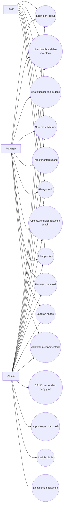
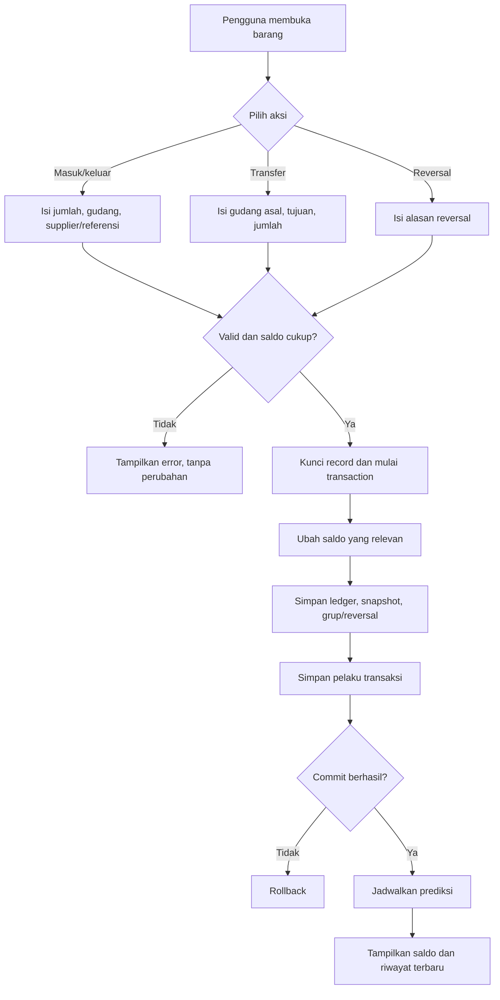
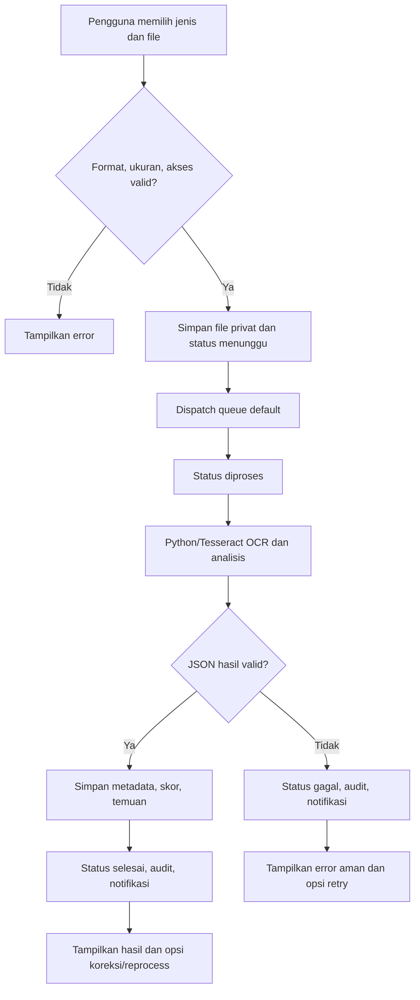

# Software Requirements Specification (SRS)

## Sistem Inventaris LogistikKu

| Informasi | Nilai |
|---|---|
| ID dokumen | SRS-LOGISTIKKU-1.4 |
| Versi | 1.4 |
| Tanggal pembaruan | 5 Oktober 2026 |
| Status | Baseline as-built terverifikasi lokal |
| Teknologi utama | Laravel 12, PHP 8.2+, SQLite/MySQL, Python, Tesseract OCR |
| Sumber implementasi | Route, controller, request, service, job, model, migration, view, dan test repository |

Dokumen ini menjelaskan fitur dan kegunaan yang benar-benar tersedia dalam aplikasi. Jika uraian berbeda dari implementasi, kode, migration, dan pengujian pada baseline repository menjadi bukti perilaku aktual.

### Daftar isi

1. [Informasi dan riwayat dokumen](#1-informasi-dan-riwayat-dokumen)
2. [Pendahuluan](#2-pendahuluan)
3. [Gambaran umum](#3-gambaran-umum-sistem)
4. [Kebutuhan fungsional](#4-kebutuhan-fungsional)
5. [Kebutuhan nonfungsional](#5-kebutuhan-nonfungsional)
6. [Hak akses](#6-hak-akses-pengguna)
7. [Aturan bisnis](#7-aturan-bisnis)
8. [Antarmuka dan dependensi](#8-antarmuka-dan-dependensi)
9. [Deployment dan keamanan](#9-deployment-batasan-dan-keamanan)
10. [Diagram](#10-use-case-dan-activity-diagram)
11. [Kriteria penerimaan](#11-kriteria-penerimaan)
12. [Ketertelusuran](#12-matriks-ketertelusuran-kebutuhan)
13. [Batasan pengembangan](#13-bagian-yang-masih-perlu-dipastikan)

---

## 1. Informasi dan Riwayat Dokumen

### 1.1 Riwayat revisi

| Versi | Tanggal | Perubahan |
|---|---|---|
| 1.0 | 15 September 2026 | Konsolidasi SRS awal. |
| 1.1 | 15 September 2026 | Audit persona, upload, dan diagram. |
| 1.2 | 17 September 2026 | Supplier, Multi-Gudang, ERD, dan Data Dictionary. |
| 1.3 | 21 September 2026 | CRUD supplier/gudang dan audit migration bersih. |
| 1.4 | 5 Oktober 2026 | Login baru, gudang A/B/C, transfer, reversal, audit pelaku, referensi transaksi, laporan mutasi, analitik, valuasi, rekonsiliasi, dan pusat notifikasi. |

### 1.2 Status kebutuhan

| Status | Arti |
|---|---|
| Sudah Tersedia | Implementasi dan bukti pengujian ditemukan. |
| Tersedia Sebagian | Implementasi tersedia tetapi cakupan atau bukti tertentu belum lengkap. |
| Perlu Uji Produksi | Berhasil diverifikasi lokal tetapi belum dibuktikan pada infrastruktur produksi. |
| Di Luar Cakupan | Sengaja tidak menjadi fitur baseline. |

### 1.3 Sumber normatif

- [ERD](./database/erd.md) dan [Data Dictionary](./data_dictionary.md).
- Seluruh source code dan pengujian dalam repository.
- [README utama](../README.md) untuk prosedur instalasi dan operasi.

---

## 2. Pendahuluan

### 2.1 Tujuan

LogistikKu menyediakan satu sistem untuk mencatat persediaan, menjaga integritas saldo setiap gudang, menelusuri transaksi, mengelola dokumen, dan membantu perencanaan restock.

### 2.2 Ruang lingkup

Sistem mencakup:

- autentikasi session dan hak akses berbasis role;
- master barang, supplier, gudang, serta pengguna;
- stok masuk/keluar, transfer gudang, reversal, dan histori audit;
- import/export inventaris dan laporan mutasi;
- dashboard, stok menipis, analitik, valuasi, dan rekonsiliasi;
- OCR Surat Jalan, Invoice, serta Bukti Fisik;
- prediksi restock dan pusat notifikasi.

Di luar baseline:

- REST API publik, token API, dan OpenAPI;
- permission dinamis di luar tiga role tetap;
- perubahan stok otomatis tanpa tindakan pengguna;
- keputusan hukum final tentang keaslian dokumen;
- health monitoring worker terpadu;
- jaminan kapasitas/performa produksi tanpa uji lingkungan target.

### 2.3 Istilah

| Istilah | Definisi |
|---|---|
| Stok total | `barang.stok`, jumlah saldo barang di seluruh gudang. |
| Saldo gudang | `warehouse_stocks.stok` untuk satu pasangan barang-gudang. |
| Ledger | `stok_transactions`, catatan utama seluruh mutasi stok. |
| Transfer | Pasangan transaksi keluar/masuk antargudang dengan satu UUID. |
| Reversal | Transaksi lawan yang membatalkan dampak transaksi salah tanpa menghapus histori. |
| Snapshot | Nilai stok, supplier, harga, atau referensi yang dibekukan saat transaksi. |
| OCR | Ekstraksi teks/metadata dari dokumen gambar atau PDF. |
| Cold-start | Prediksi berdasarkan estimasi karena histori belum cukup. |
| Confidence | Ukuran keyakinan perhitungan, bukan kepastian. |

---

## 3. Gambaran Umum Sistem

### 3.1 Perspektif

LogistikKu adalah aplikasi web Laravel. Blade/JavaScript menjadi antarmuka; middleware, Gate, dan Form Request menangani akses/validasi; service menjalankan aturan bisnis; database menyimpan state; queue dan Python menangani OCR/prediksi.

| Lapisan | Tanggung jawab |
|---|---|
| UI | Form, tabel, grafik, status, notifikasi, dan respons pengguna. |
| Laravel HTTP | Route, autentikasi, otorisasi, validasi, serta respons. |
| Service | Stok atomik, transfer, reversal, import, laporan, analitik, notifikasi. |
| Queue/job | OCR dan prediksi yang dapat berjalan di background. |
| Database | Master, saldo, ledger, audit, session, cache, dan queue. |
| Storage | Foto publik dan dokumen privat. |
| Python | OCR/analisis citra dan kalkulasi prediksi. |

### 3.2 Aktor

| Aktor | Tujuan |
|---|---|
| Admin | Mengelola master, akun, analitik, import/export, dan seluruh proses inventaris. |
| Manager | Memantau/mengoreksi operasi, laporan, reversal, prediksi, dan dokumen sendiri. |
| Staff | Menjalankan operasi gudang dan mengelola dokumen sendiri. |
| Worker | Menyelesaikan OCR/prediksi dan memperbarui status/notifikasi. |
| Operator | Menyediakan database, worker, storage, Python, Tesseract, backup, dan monitoring. |

### 3.3 Data utama

Migration bersih membentuk 23 tabel, 218 kolom, dan 24 FK. Lima belas tabel bisnis digambarkan pada ERD; delapan tabel framework menangani session, cache, queue, dan migration.

---

## 4. Kebutuhan Fungsional

### 4.1 Autentikasi dan pengguna

| ID | Kebutuhan dan kegunaan | Status |
|---|---|---|
| FR-AUTH-001 | Pengguna dapat login dengan email/password; email dinormalisasi dan session diregenerasi. | Sudah Tersedia |
| FR-AUTH-002 | Pengguna dapat memilih remember-me dan logout dengan invalidasi session/token CSRF. | Sudah Tersedia |
| FR-AUTH-003 | Login gagal dibatasi lima kali per email/IP selama 60 detik dan menampilkan pesan aman. | Sudah Tersedia |
| FR-AUTH-004 | Guest yang membuka fitur terlindungi diarahkan ke `/login`; pengguna aktif tidak kembali ke form login. | Sudah Tersedia |
| FR-AUTH-005 | Admin dapat CRUD pengguna; aplikasi memakai role `admin`, `manager`, dan `staff`. | Sudah Tersedia |
| FR-AUTH-006 | Kredensial akun demo tidak boleh ditampilkan pada halaman login; dokumentasi lokal menjadi sumber kredensial pengembangan. | Sudah Tersedia |

### 4.2 Master dan inventaris

| ID | Kebutuhan dan kegunaan | Status |
|---|---|---|
| FR-INV-001 | Semua role dapat melihat, mencari kode/nama/lokasi, memfilter kategori/status, mengurutkan, dan membuka detail barang aktif. | Sudah Tersedia |
| FR-INV-002 | Admin dapat membuat barang dengan kode `BRG-######`, supplier, kategori, satuan, harga beli, lokasi, foto, estimasi penggunaan, dan lead time. | Sudah Tersedia |
| FR-INV-003 | Admin dapat mengubah master barang tanpa mengubah kode/stok langsung. | Sudah Tersedia |
| FR-INV-004 | Admin dapat soft delete, restore, hapus permanen aman, dan aksi massal di Tong Sampah. | Sudah Tersedia |
| FR-INV-005 | Sistem menampilkan stok menipis ketika total stok `<= 5`. | Sudah Tersedia |
| FR-INV-006 | Semua role dapat melihat supplier; Admin dapat CRUD supplier aktif/nonaktif. | Sudah Tersedia |
| FR-INV-007 | Semua role dapat melihat gudang dan saldo; Admin dapat CRUD gudang aktif/nonaktif. | Sudah Tersedia |
| FR-INV-008 | Gudang standar `GDG-UTAMA`, `GDG-A`, `GDG-B`, dan `GDG-C` dibuat migration secara idempoten. | Sudah Tersedia |
| FR-INV-009 | Satu pasangan barang-gudang hanya mempunyai satu record saldo. | Sudah Tersedia |

### 4.3 Transaksi, transfer, reversal, dan riwayat stok

| ID | Kebutuhan dan kegunaan | Status |
|---|---|---|
| FR-STK-001 | Semua role dapat mencatat stok masuk/keluar dengan jumlah positif, gudang, supplier, harga, keterangan, serta referensi opsional. | Sudah Tersedia |
| FR-STK-002 | Sistem menolak stok keluar yang melebihi saldo gudang atau total stok. | Sudah Tersedia |
| FR-STK-003 | Perubahan saldo, total barang, transaksi, dan pelaku berlangsung atomik dengan penguncian data. | Sudah Tersedia |
| FR-STK-004 | Ledger menyimpan jenis mutasi, stok sebelum/sesudah, supplier, unit cost/sumber, dokumen referensi, dan pelaku. | Sudah Tersedia |
| FR-STK-005 | Semua role dapat mentransfer barang antar gudang aktif; asal dan tujuan harus berbeda dan saldo asal cukup. | Sudah Tersedia |
| FR-STK-006 | Transfer membuat pasangan transaksi keluar/masuk dengan `transfer_group_uuid` sama dan tidak mengubah total barang. | Sudah Tersedia |
| FR-STK-007 | Admin/Manager dapat melakukan reversal beralasan; transaksi asli tetap ada dan ditandai. | Sudah Tersedia |
| FR-STK-008 | Transaksi yang telah direversal tidak dapat direversal ulang. | Sudah Tersedia |
| FR-STK-009 | Riwayat menampilkan timeline, tabel, grafik, gudang, supplier, pelaku, referensi, transfer, dan reversal. | Sudah Tersedia |
| FR-STK-010 | Prediksi baru dijadwalkan setelah transaksi berhasil di-commit. | Sudah Tersedia |

### 4.4 Import dan export

| ID | Kebutuhan dan kegunaan | Status |
|---|---|---|
| FR-IO-001 | Admin dapat mengunduh template XLSX/CSV. | Sudah Tersedia |
| FR-IO-002 | Admin dapat mengimpor XLSX/XLS/CSV maksimum 5 MiB dengan enam kolom wajib. | Sudah Tersedia |
| FR-IO-003 | Seluruh batch divalidasi sebelum commit; satu kegagalan membatalkan semua perubahan. | Sudah Tersedia |
| FR-IO-004 | Stok target hasil import diterapkan melalui service transaksi agar ledger/saldo konsisten. | Sudah Tersedia |
| FR-IO-005 | Admin dapat mengekspor inventaris aktif ke CSV, XLSX, atau PDF. | Sudah Tersedia |

### 4.5 Dashboard, analitik, laporan, dan notifikasi

| ID | Kebutuhan dan kegunaan | Status |
|---|---|---|
| FR-AN-001 | Dashboard menampilkan jumlah barang/stok/kategori, stok menipis, aktivitas 7/30 hari, dan pusat perhatian. | Sudah Tersedia |
| FR-AN-002 | Admin dapat melihat mutasi, Fast/Slow/Dead Stock, valuasi, distribusi kategori/gudang, dan rekonsiliasi saldo. | Sudah Tersedia |
| FR-AN-003 | Valuasi menggunakan saldo terkini dikali harga beli dan membedakan harga kosong dari nol. | Sudah Tersedia |
| FR-AN-004 | Filter supplier/gudang/kategori diterapkan pada dataset relevan; tanggal hanya membatasi mutasi. | Sudah Tersedia |
| FR-AN-005 | Ringkasan otomatis analitik bersifat deterministik dan menyatakan keterbatasan data. | Sudah Tersedia |
| FR-AN-006 | Admin/Manager dapat melihat laporan mutasi dengan identitas saldo awal + masuk - keluar = akhir. | Sudah Tersedia |
| FR-AN-007 | Laporan mutasi dapat diekspor ke CSV, XLSX, PDF; analitik dapat diekspor CSV. | Sudah Tersedia |
| FR-AN-008 | Pusat notifikasi menggabungkan OCR, prediksi, dan perhatian operasional; pengguna dapat membuka serta menandai dibaca. | Sudah Tersedia |

### 4.6 Verifikasi dokumen OCR

| ID | Kebutuhan dan kegunaan | Status |
|---|---|---|
| FR-OCR-001 | Semua role dapat upload Surat Jalan, Invoice, atau Bukti Fisik berformat PDF/JPG/JPEG/PNG maksimum 10 MiB. | Sudah Tersedia |
| FR-OCR-002 | File disimpan privat per pengguna; upload membuat status `menunggu` dan job queue `default`. | Sudah Tersedia |
| FR-OCR-003 | Python/Tesseract mengekstrak teks/metadata serta skor readability, completeness, authenticity, overall, confidence, dan temuan. | Sudah Tersedia |
| FR-OCR-004 | Status proses `menunggu/diproses/selesai/gagal` terpisah dari hasil `asli/mencurigakan/palsu`. | Sudah Tersedia |
| FR-OCR-005 | Admin dapat melihat semua dokumen; Manager/Staff hanya dokumen sendiri. | Sudah Tersedia |
| FR-OCR-006 | Pemilik/Admin dapat mengoreksi metadata dan memperoleh jejak audit before/after. | Sudah Tersedia |
| FR-OCR-007 | Pengguna berhak dapat retry proses gagal, reprocess hasil, memantau status, dan mengunduh file. | Sudah Tersedia |
| FR-OCR-008 | Hasil selesai/gagal menghasilkan notifikasi idempoten untuk pemilik. | Sudah Tersedia |

### 4.7 Prediksi stok

| ID | Kebutuhan dan kegunaan | Status |
|---|---|---|
| FR-ML-001 | Semua role dapat melihat hasil; Admin/Manager dapat menganalisis satu/semua barang. | Sudah Tersedia |
| FR-ML-002 | Analisis berjalan di queue `stock-predictions` dengan state waiting/processing/completed/failed. | Sudah Tersedia |
| FR-ML-003 | Input mencakup stok, histori keluar, minimum, estimasi harian, lead time, horizon, dan kecukupan histori. | Sudah Tersedia |
| FR-ML-004 | Engine memilih `cold_start`, `simple_average`, atau `machine_learning` sesuai data. | Sudah Tersedia |
| FR-ML-005 | Hasil mencakup risiko, kebutuhan, tanggal minimum/habis, safety stock, restock, metode, confidence, dan alasan. | Sudah Tersedia |
| FR-ML-006 | Laravel memakai fallback lokal bila Python timeout/gagal/JSON invalid. | Sudah Tersedia |
| FR-ML-007 | Scheduler menjaga satu proses aktif per barang dan generation terbaru. | Sudah Tersedia |
| FR-ML-008 | Admin/Manager dapat menerapkan rekomendasi ke form stok masuk; stok tidak berubah otomatis. | Sudah Tersedia |
| FR-ML-009 | Perubahan risiko ke Perlu Restock/Mendesak membuat notifikasi dengan status baca per pengguna. | Sudah Tersedia |

---

## 5. Kebutuhan Nonfungsional

### 5.1 Keamanan

| ID | Kebutuhan | Status |
|---|---|---|
| NFR-SEC-001 | Semua form perubahan memakai CSRF dan route sensitif memakai autentikasi/otorisasi server. | Sudah Tersedia |
| NFR-SEC-002 | Session diregenerasi saat login dan diinvalidasi saat logout. | Sudah Tersedia |
| NFR-SEC-003 | Password disimpan dalam bentuk hash dan tidak diserialisasikan. | Sudah Tersedia |
| NFR-SEC-004 | Dokumen OCR berada di storage privat dan download memeriksa kepemilikan. | Sudah Tersedia |
| NFR-SEC-005 | Error pengguna tidak membuka kredensial, stack trace, atau detail internal. | Sudah Tersedia pada konfigurasi aplikasi; produksi wajib `APP_DEBUG=false`. |

### 5.2 Integritas dan reliabilitas

- Perubahan stok memakai database transaction dan row lock.
- Constraint menolak jumlah/saldo/harga negatif serta snapshot yang tidak konsisten.
- FK `RESTRICT` melindungi histori utama.
- Transfer dan reversal tidak menghapus histori.
- Queue menyimpan status proses dan kegagalan dapat diperiksa melalui `failed_jobs`.
- Prediksi gagal tidak membatalkan transaksi stok yang sah.

### 5.3 Performa

- Daftar menggunakan pagination dan eager loading yang relevan.
- Filter dashboard menyediakan endpoint JSON internal untuk pembaruan parsial.
- Grafik histori membatasi data terbaru.
- OCR dan prediksi dijalankan melalui queue agar request utama tidak menunggu pekerjaan berat.
- Target kapasitas produksi harus diuji pada data dan infrastruktur target.

### 5.4 Usability dan aksesibilitas

- Antarmuka responsif pada desktop, tablet, dan ponsel.
- Form utama memiliki label, error, fokus, state loading, dan kondisi kosong.
- Grafik penting memiliki alternatif tabel atau ringkasan teks.
- Halaman login menyediakan show/hide password tanpa menampilkan kredensial akun demo.
- Warna bukan satu-satunya pembeda status; teks/badge digunakan.

### 5.5 Kompatibilitas dan observabilitas

- PHP 8.2+, Laravel 12, Node 18/20/22+, dan Python 3.10+.
- Database mendukung SQLite serta konfigurasi MySQL/MariaDB.
- Log Laravel, `queue:failed`, status proses OCR, dan proses prediksi menjadi sarana diagnosis.
- Health monitoring worker otomatis belum tersedia.

---

## 6. Hak Akses Pengguna

| Fitur | Admin | Manager | Staff |
|---|:---:|:---:|:---:|
| Dashboard, barang, supplier, gudang | Ya | Ya | Ya |
| Stok masuk/keluar dan transfer | Ya | Ya | Ya |
| Reversal transaksi | Ya | Ya | Tidak |
| Laporan mutasi/export | Ya | Ya | Tidak |
| Lihat prediksi tersimpan | Ya | Ya | Ya |
| Jalankan prediksi/terapkan restock | Ya | Ya | Tidak |
| Upload dan kelola dokumen sendiri | Ya | Ya | Ya |
| Lihat semua dokumen | Ya | Tidak | Tidak |
| CRUD barang/supplier/gudang | Ya | Tidak | Tidak |
| Import/export inventaris | Ya | Tidak | Tidak |
| Analitik bisnis | Ya | Tidak | Tidak |
| Tong Sampah dan pengguna | Ya | Tidak | Tidak |

Akses yang ditolak menghasilkan `403`. Guest diarahkan ke halaman login. Menyembunyikan tombol di UI tidak menggantikan pemeriksaan server.

---

## 7. Aturan Bisnis

1. Kode barang otomatis dan tidak dapat diubah setelah tersimpan.
2. Stok dan harga beli tidak boleh negatif.
3. Total `barang.stok` harus sama dengan jumlah saldo seluruh gudang.
4. Stok keluar/transfer tidak boleh melebihi saldo asal.
5. Transfer harus memakai gudang asal dan tujuan berbeda.
6. Dua sisi transfer harus berhasil/gagal bersama.
7. Reversal hanya untuk Admin/Manager, memerlukan alasan, dan hanya sekali per transaksi.
8. Histori tidak dihapus untuk memperbaiki kesalahan; gunakan reversal.
9. Supplier/harga/referensi transaksi disimpan sebagai snapshot audit.
10. Barang dengan stok `<= 5` termasuk stok menipis.
11. Import bersifat all-or-nothing.
12. Hasil OCR bukan keputusan keaslian hukum.
13. Prediksi tidak mengubah stok otomatis.
14. Status baca notifikasi prediksi adalah milik masing-masing pengguna.
15. Soft delete mempertahankan histori; force delete tunduk pada FK dan pemeriksaan dependensi.

---

## 8. Antarmuka dan Dependensi

### 8.1 Route dan UI

Seluruh fitur berada pada `routes/web.php` dan menggunakan autentikasi session. Endpoint JSON untuk dashboard, notifikasi, dan status proses adalah kontrak internal UI, bukan REST API publik.

### 8.2 Database dan storage

- SQLite menjadi konfigurasi development sederhana; MySQL/MariaDB dapat digunakan.
- Foto barang berada pada disk `public` dan membutuhkan `storage:link`.
- Dokumen verifikasi berada pada disk `local` privat.
- File referensi transaksi mengikuti path yang dicatat oleh service terkait.

### 8.3 Queue dan Python

| Queue | Job | Kegunaan |
|---|---|---|
| `default` | `ProcessDocumentVerification` | OCR dan analisis dokumen. |
| `stock-predictions` | `ProcessStockPrediction` | Prediksi stok satu barang/generation. |

Python dijalankan melalui Symfony Process, bukan server HTTP. Tesseract harus tersedia untuk OCR. Kontrak komunikasi menggunakan JSON.

### 8.4 Format file

| Proses | Format | Batas |
|---|---|---:|
| Import barang | XLSX, XLS, CSV | 5 MiB |
| Dokumen OCR | PDF, JPG, JPEG, PNG | 10 MiB |
| Export inventaris | CSV, XLSX, PDF | Dihasilkan server |
| Export laporan | CSV, XLSX, PDF | Dihasilkan server |

---

## 9. Deployment, Batasan, dan Keamanan

### 9.1 Kebutuhan deployment

- `APP_KEY` terisi, `APP_DEBUG=false`, dan HTTPS pada produksi.
- Database, session, cache, dan queue dapat diakses aplikasi/worker.
- Worker `default` dan `stock-predictions` dikelola process supervisor.
- `PYTHON_EXECUTABLE`, dependency Python, dan Tesseract valid.
- Storage publik/private memiliki permission yang tepat.
- Backup database/storage, rotasi log, monitoring, dan prosedur recovery tersedia.

### 9.2 Batasan

- Tidak ada API publik atau autentikasi token.
- Tidak ada health check worker terintegrasi.
- Tabel `stok_histories` masih dipertahankan sebagai legacy.
- Valuasi adalah snapshot sekarang, bukan valuasi historis.
- Data supplier tidak dipisahkan per lot kepemilikan stok.
- Akurasi OCR/prediksi bergantung pada kualitas dokumen dan histori.

### 9.3 Keamanan repository

Jangan commit `.env`, database lokal, dokumen pengguna, backup, token, log, atau profil browser. Akun demo harus diganti/dihapus sebelum akses publik.

---

## 10. Use Case dan Activity Diagram

### 10.1 Use Case Diagram Sistem

```mermaid
flowchart LR
    A[Admin]
    M[Manager]
    S[Staff]

    UC1((Login dan logout))
    UC2((Lihat dashboard dan inventaris))
    UC3((Lihat supplier dan gudang))
    UC4((Stok masuk/keluar))
    UC5((Transfer antargudang))
    UC6((Riwayat stok))
    UC7((Upload/verifikasi dokumen sendiri))
    UC8((Lihat prediksi))
    UC9((Reversal transaksi))
    UC10((Laporan mutasi))
    UC11((Jalankan prediksi/restock))
    UC12((CRUD master dan pengguna))
    UC13((Import/export dan trash))
    UC14((Analitik bisnis))
    UC15((Lihat semua dokumen))

    A --> UC1 & UC2 & UC3 & UC4 & UC5 & UC6 & UC7 & UC8 & UC9 & UC10 & UC11 & UC12 & UC13 & UC14 & UC15
    M --> UC1 & UC2 & UC3 & UC4 & UC5 & UC6 & UC7 & UC8 & UC9 & UC10 & UC11
    S --> UC1 & UC2 & UC3 & UC4 & UC5 & UC6 & UC7 & UC8
```

[Buka render SVG Use Case](./images/tugas-1-2-use-case.svg).

### 10.2 Activity Diagram Stok

```mermaid
flowchart TD
    A[Pengguna membuka barang] --> B{Pilih aksi}
    B -->|Masuk/keluar| C[Isi jumlah, gudang, supplier/referensi]
    B -->|Transfer| D[Isi gudang asal, tujuan, jumlah]
    B -->|Reversal| E[Isi alasan reversal]
    C --> V{Valid dan saldo cukup?}
    D --> V
    E --> V
    V -->|Tidak| X[Tampilkan error, tanpa perubahan]
    V -->|Ya| L[Kunci record dan mulai transaction]
    L --> U[Ubah saldo yang relevan]
    U --> T[Simpan ledger, snapshot, grup/reversal]
    T --> P[Simpan pelaku transaksi]
    P --> K{Commit berhasil?}
    K -->|Tidak| R[Rollback]
    K -->|Ya| Q[Jadwalkan prediksi]
    Q --> H[Tampilkan saldo dan riwayat terbaru]
```

[Buka render SVG Activity Stok](./images/tugas-1-2-activity-stok.svg).

### 10.3 Activity Diagram Verifikasi Dokumen

```mermaid
flowchart TD
    A[Pengguna memilih jenis dan file] --> V{Format, ukuran, akses valid?}
    V -->|Tidak| E[Tampilkan error]
    V -->|Ya| S[Simpan file privat dan status menunggu]
    S --> Q[Dispatch queue default]
    Q --> P[Status diproses]
    P --> Y[Python/Tesseract OCR dan analisis]
    Y --> J{JSON hasil valid?}
    J -->|Tidak| G[Status gagal, audit, notifikasi]
    J -->|Ya| H[Simpan metadata, skor, temuan]
    H --> F[Status selesai, audit, notifikasi]
    F --> O[Tampilkan hasil dan opsi koreksi/reprocess]
    G --> R[Tampilkan error aman dan opsi retry]
```

[Buka render SVG Activity Verifikasi](./images/tugas-1-2-activity-verifikasi.svg).

---

## 11. Kriteria Penerimaan

### 11.1 Umum

- Route hanya dapat diakses oleh role yang sesuai.
- Input invalid tidak mengubah database atau file secara parsial.
- Operasi stok menjaga total dan saldo gudang konsisten.
- Pesan keberhasilan/kegagalan dapat dipahami pengguna.
- Kondisi kosong/loading/error tampil jelas.
- Test relevan lulus pada database terisolasi.

### 11.2 Checklist modul

| Modul | Penerimaan utama |
|---|---|
| Login | Halaman tampil, kredensial valid berhasil, gagal dibatasi, logout menghapus session. |
| Master | Filter/detail benar; CRUD hanya Admin; soft delete dan FK aman. |
| Stok | Saldo/ledger/pelaku konsisten; stok tidak negatif. |
| Transfer | Dua sisi atomik, total tidak berubah, UUID sama. |
| Reversal | Akses benar, alasan tersimpan, transaksi lawan dibuat, tidak dapat diulang. |
| Import/export | Format/isi benar dan import rollback penuh saat invalid. |
| Laporan/analitik | Filter, perhitungan, pagination, rekonsiliasi, dan export konsisten. |
| OCR | File privat, status/ownership benar, kontrak JSON/audit/notifikasi konsisten. |
| Prediksi | Queue/state/metode/fallback/rekomendasi sesuai input dan role. |

---

## 12. Matriks Ketertelusuran Kebutuhan

### 12.1 Kebutuhan fungsional

| Kelompok | Implementasi utama | Bukti |
|---|---|---|
| FR-AUTH | `AuthController`, route guest/auth, login Blade | `LoginPageTest`, `AuthRateLimitTest`, `CsrfSessionTest` |
| FR-INV | `BarangController`, `SupplierController`, `WarehouseController`, model/request/view | Test barang, supplier, warehouse, dashboard |
| FR-STK | `StockAdjustmentService`, transfer/reversal controller/service | Test integritas, transfer/reversal, laporan |
| FR-IO | Importer, report controller, CSV/PDF/Excel service | `BarangImportTest`, `BarangCsvTest`, fitur export |
| FR-AN | Dashboard/analytics/report/notification service | Test dashboard, analytics, report, notification |
| FR-OCR | Controller, job, verification/audit/result service, Python checker | Test dokumen, status, audit, ownership, Python |
| FR-ML | Scheduler, job, service, presenter, Python predictor | Test prediksi, queue, process, notification |

### 12.2 Kebutuhan nonfungsional

| Kelompok | Bukti |
|---|---|
| Keamanan | Middleware, Gate, CSRF, rate limiter, ownership test |
| Integritas | Transaction, lock, FK/check/unique, migration dan integration test |
| Usability | Komponen Blade, CSS responsif, state kosong/loading/error |
| Reliabilitas | Queue state, retry/fallback, failed jobs, audit trail |
| Kompatibilitas | PHPUnit SQLite in-memory, konfigurasi SQLite/MySQL, unit test Python |

### 12.3 Bukti eksekusi audit 5 Oktober 2026

- Seluruh 32 migration berhasil dijalankan dari database SQLite kosong.
- Skema hasil audit: 23 tabel, 218 kolom, dan 24 FK.
- Suite Laravel: 348 test dan 4.227 assertion lulus pada baseline pembaruan login/dokumentasi.
- Build Vite produksi berhasil.
- Validasi database produksi tetap **Perlu Uji Produksi**.

---

## 13. Bagian yang Masih Perlu Dipastikan

1. Uji beban dan target response time pada data/infrastruktur produksi.
2. Verifikasi skema, engine, collation, constraint, serta backfill pada MySQL/MariaDB target.
3. Monitoring/alert worker dan health endpoint untuk queue.
4. Kebijakan retensi dokumen privat, audit, dan backup.
5. Dataset evaluasi OCR dan monitoring akurasi prediksi yang lebih luas.
6. REST API publik bila integrasi pihak ketiga dibutuhkan.
7. Automated browser/E2E lintas viewport dan browser.
